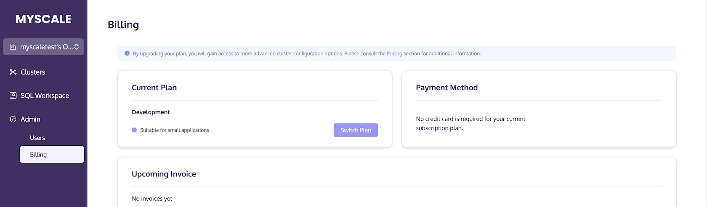
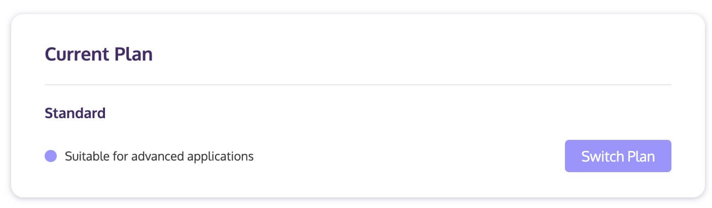
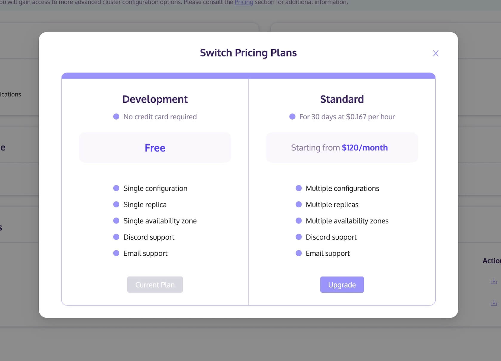
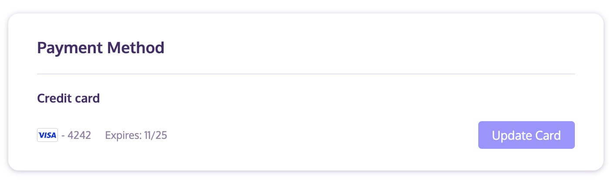
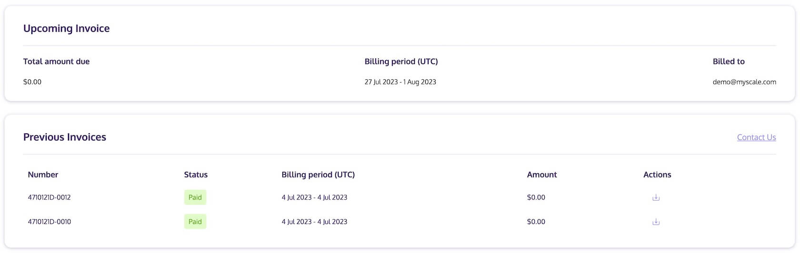

# Billing

This document provides instructions on managing the billing plan, modifying the payment method, and obtaining invoices for your account.

## Billing Method

For each cluster, billing is based on the usage time of pods, including their type, size, and replica. Invoices will be automatically generated at the beginning of the second month based on actual usage time. If you have any inquiries, please refer to our <a :href="$themeConfig.homeUrl + '/pricing/'" target="_blank" rel="noopener">Pricing Plan</a> or feel free to <a :href="$themeConfig.homeUrl + '/contact/'" target="_blank" rel="noopener">Contact Us</a>.

## Changing Your Billing Plan

To change your billing plan through the MyScale console, follow these steps:

1. Sign in to MyScale.
2. Click on Admin >> Billing.

3. Click on Switch Plan Button.

4. Select the desired Billing Plan from the pop-up window.

## Payment Method

You can update your card within this window.

## Invoice

On the billing page, you can view and download upcoming invoices as well as previous invoices.

