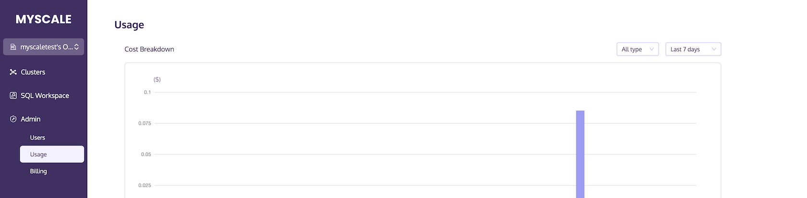

# Monitoring Usage

This document provides instructions on how to monitor the usage and cost of your cluster through the MyScale console.

To view the usage of your cluster through the MyScale console, follow the steps below:

1. Sign in to MyScale.
2. Click on Admin >> Usage.

You can view the usage and cost of the cluster by selecting Last 7 days, Last 28 days, or Last 3 months.
