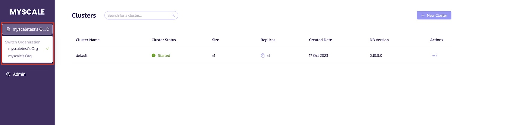
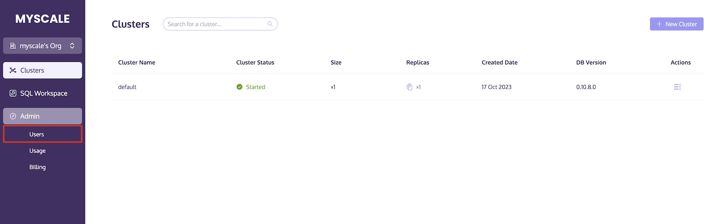
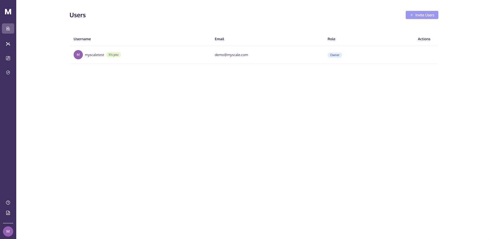
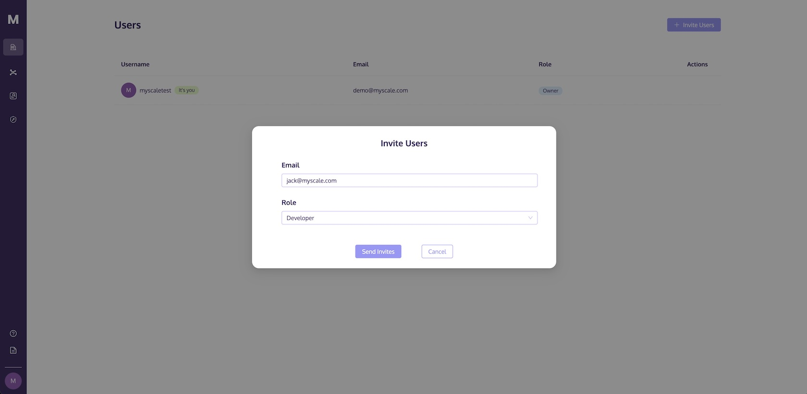
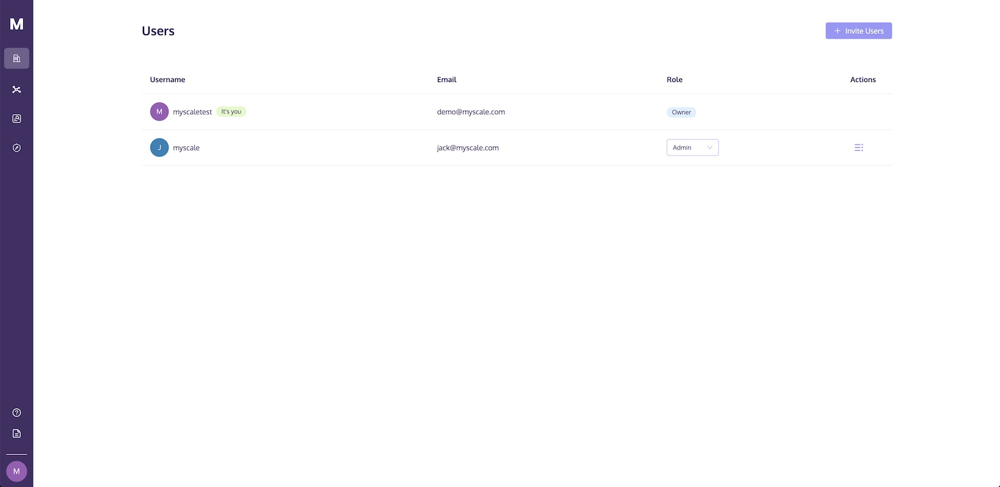
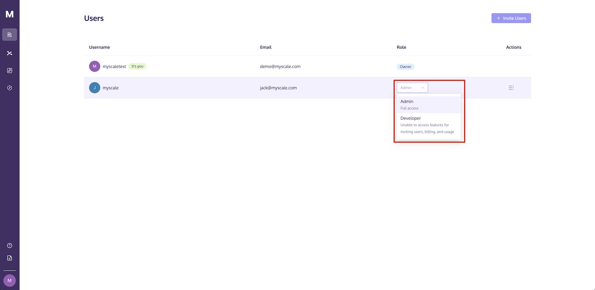
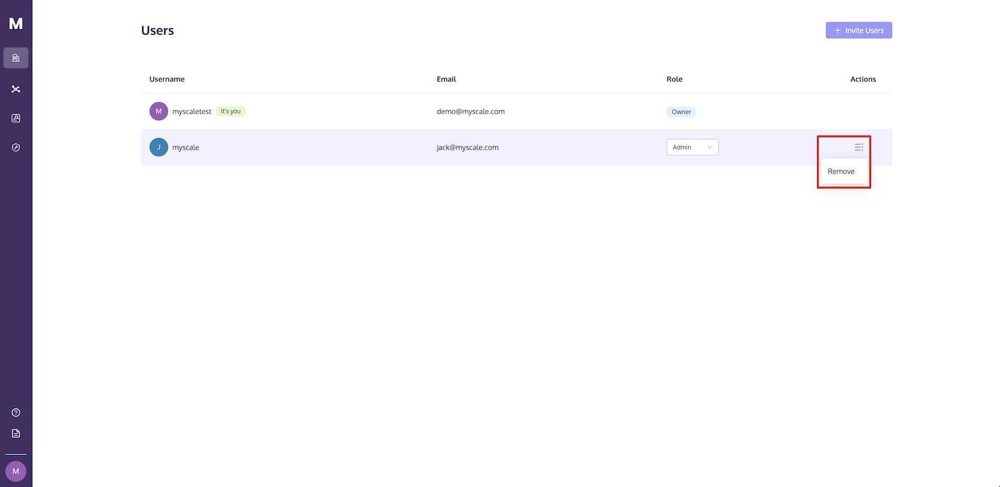

# Organization and Roles

MyScale offers organization management capabilities, where each account joining the organization is assigned a role that determines their permissions within the organization. This document will outline the permissions associated with each role and provide instructions for organization administrators to add and remove accounts, among other organization management actions.

- [MyScale Roles and Allowed Actions](#myscale-roles-and-allowed-actions)
- [Switch Organization](#switch-organization)
- [Invite User](#invite-user)
- [Modify User Role](#modify-user-role)
- [Remove User](#remove-user)

## MyScale Roles and Allowed Actions

In every organization, three distinct types of roles with varying levels of account privileges can be assigned to individuals within the organization. They are as follows:

* Owner
* Administrator (Admin)
* Developer

The following table summarizes the different account privileges to assist you in determining how the roles should be assigned:

| **Category**               | **Action**                | **Owner** | **Admin** | **Developer** |
| --------------------------- | -------------------------- | --------- | --------- | ------------ |
| Cluster Management        | Create Cluster             | ✅         | ✅         | ❌            |
|                           | Configure Cluster          | ✅         | ✅         | ❌            |
|                           | Start Cluster              | ✅         | ✅         | ✅            |
|                           | Stop Cluster               | ✅         | ✅         | ✅            |
|                           | Import Sample Data         | ✅         | ✅         | ✅            |
|                           | Reset Cluster Password     | ✅         | ✅         | ❌            |
|                           | View Cluster Monitoring    | ✅         | ✅         | ✅            |
|                           | Delete Cluster             | ✅         | ✅         | ❌            |
|                           | SQL Execution              | ✅         | ✅         | ✅            |
| Developer Tools           | Python Client              | ✅         | ✅         | ✅            |
|                           | Node.js Client             | ✅         | ✅         | ✅            |
|                           | Go Client                  | ✅         | ✅         | ✅            |
|                           | JDBC Driver                | ✅         | ✅         | ✅            |
|                           | HTTPS Interface            | ✅         | ✅         | ✅            |
| Organization Management   | View Organization Users    | ✅         | ✅         | ✅            |
|                           | Invite User                | ✅         | ✅         | ❌            |
|                           | Modify User Role           | ✅         | ✅         | ❌            |
|                           | Remove User                | ✅         | ✅         | ❌            |
| Usage                     | View Organization Usage    | ✅         | ✅         | ❌            |
| Billing                   | Switch Pricing Plan        | ✅         | ✅         | ❌            |
|                           | Update Credit Card         | ✅         | ✅         | ❌            |
|                           | View Billing Information   | ✅         | ✅         | ❌            |
| Support & Help            | Submit Support Ticket      | ✅         | ✅         | ✅            |

## Switch Organization

One account can be linked to multiple organizations, enabling users to switch between them easily via the top-left option.

 

::: tip
Under the Development Plan, the current organization permits a maximum of 2 accounts, whereas under the Standard Plan, the current organization allows for up to 25 accounts.
:::

## Invite User

Organization administrators have the ability to extend invitations to users for joining the organization. These invitations are dispatched to the respective users via email.

1. Within the Admin section, navigate to Users and access the relevant page.

 

2. Opt for the "Invite User" option.

 

3. Insert the email address of the user you wish to invite.

 

4. Below the role assignment, designate the role you intend to assign to the user, and then select "Send Invitation."

 

The invitation email will be transmitted to the email address you provided. This invitation contains a link that allows the recipient to either log in or register and accept the invitation to access MyScale.

::: warning NOTE
Please note that after sign up or sign in, you will still need to click the button in the invitation email once more to complete the registration process.
:::

## Modify User Role

Organization administrators have the capability to modify a user's role within the organization.

1. Within the user list, locate the column corresponding to the user's role.

 

2. Click on the user's role option that you wish to modify and select the desired role to make the change.

 

## Remove User

Organization administrators can remove a user from the organization using the following steps:

1. In the "User Management" list, locate the user you intend to remove.
2. In the "Actions" section, choose "Remove."

 

3. Confirm the action by clicking "Remove" to remove the user.
