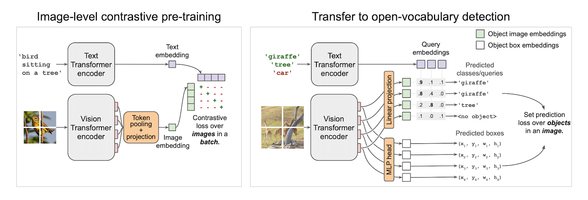

# Object Detection Safari

<a href="https://huggingface.co/spaces/myscale/object-detection-safari"  style="padding-left: 0.5rem;"></a>

<video controls loop autoplay muted preload="auto">
  <source src="https://myscale-demo.s3.ap-southeast-1.amazonaws.com/object-dataset-explorer/demo-owlvit_compressed.mp4" type="video/mp4">
</video>

The previous tutorial demonstrated some basic uses of the MyScale database, such as inserting and querying Top-K unstructured vectors. And this demo will try to cover more advanced features in MyScale.

MyScale is designed to serve high-performance vector search with SQL in billion scales. We introduce [COCO dataset](https://cocodataset.org/#home) as our data source to make this tutorial more practical, which contains more than 280 thousand images and approximately 1.3 million annotated objects. Extraction and querying object-level information requires a more fine-grained understanding of images. Also, it's larger and harder because the number of objects is much bigger than the number of images, especially for a dataset like COCO.

Searching objects is a complicated task, and searching among billions of objects is even more challenging. But it has more applications than image-level search. For example, object-level understanding can reduce labour on data labelling and object annotation process for many industries.

Object-level information has many forms in data. The bounding box is the most popular and cheapest solution to store. It uses a rectangle that can crop the object out of the image and a label that describes which category it is. We need to save the rectangle and its label or label embedding for further query. Beyond this, we also need to take care of relations between bounding boxes. Relations involved among bounding boxes can be listed below:

1. An Image may contain multiple bounding boxes of different instances.
2. Bounding boxes may have duplications.

Considering all factors above, we can divide them into two pieces: the one MyScale can do and the one it cannot. The database can take care of the first factor by using a box table and an image table at the same time. It also can do more things like object sorting and grouping, multi-criterion search and prediction probability computing. You only need to handle the second one: eliminating duplicated boxes, which can be simply implemented with non-maximum suppression (NMS).

## Dataset Overview

We selected 287,104 images from COCO Dataset, including all images from the train/test/validation/unlabeled set. It contains about 1.3 million annotated images in 81 classes. We choose this dataset for its high variance and density of objects, which may give us surprises in retrieving uncovered categories of objects. For example, detecting people with white shirts, cupboards or even stop signs:


It is pretty easy to obtain COCO Dataset. Just download all those JSON and parse it.

```bash
wget http://images.cocodataset.org/annotations/annotations_trainval2017.zip
unzip annotations_trainval2017.zip
```

After loading and parsing its data, you will find a unique image URL under the key `coco_url` for every single image. We will use a specific image to demonstrate how a feature is extracted.

```python
import requests
from PIL import Image
from io import BytesIO
from transformers import OwlViTProcessor, OwlViTForObjectDetection

response = requests.get("http://images.cocodataset.org/train2017/000000391895.jpg")
img = Image.open(BytesIO(response.content))
img_s = img.size
if img.mode in ['L', 'CMYK', 'RGBA']:
    # L is grayscale, CMYK uses alternative colour channels
    img = img.convert('RGB')
```


## Open-Vocabulary Object Detection

Vision-Text models are made for black magic. It can give you a classifier with a single spell. [CLIP](https://openai.com/blog/clip) is achieving this on the image level, enabling zero-shot image classification. It aligns features from the visual and textual domain with a contrastive loss. We have already seen its amazing performance in [the few-shot learning demo](https://huggingface.co/spaces/myscale/visual-dataset-explorer). Inspired by CLIP, it might be more interesting if we apply CLIP on small patches and predict boxes on those small patches. The aligned vision-text feature for every box will make us a zero-shot detector spontaneously. And bingo! This is how [OWLViT](https://arxiv.org/pdf/2205.06230.pdf) works.



OWLViT splits detection and classification in a parallel fashion. It will leave the class aside and give you boxes even if it has no idea what it had just detected. And it is up to you to give those boxes meaning, by using a query embedding. This makes our search easy and does not require extra computation on RoI classification. What we have are just boxes and their embeddings. Rank those boxes using the inner product between the query vector and the class embedding will give us similar objects in datasets.

However, there is a pitfall you might step into when you manage to design a storage solution. The actual network output is a little more complicated than the figure demonstrated. Besides the two outputs drawn in the figure, it also generates a scale and a shift scalar to magnify or shrink the confidence in the prediction. So the actual prediction formula should be written and simplified as this:
$$y=\mu(\langle q, v\rangle + \beta)=\langle q,\mu v\rangle + \mu\beta = \Big\langle[q\; 1],[\mu v\;\mu\beta]\Big\rangle$$
This makes the logit computation into the form of an inner product, which would be pretty neat for our vector search in MyScale.

Let’s get back to the code. As usual, we pre-process the image to fit the model’s input.

```python
from transformers import OwlViTProcessor, OwlViTForObjectDetection
name = "google/owlvit-base-patch32"
model = OwlViTForObjectDetection.from_pretrained(name)
processor = OwlViTProcessor.from_pretrained(name)

# Preprocess image
ret = processor(text=txt, images=img, return_tensor='pt')
img = ret['pixel_values'][0]
```

We tweaked a bit inside OWLViT because we want to manually extract the image feature and boxes using the previous formula.

```python
def extract_visual_feature(img):
    with torch.no_grad():
        model.eval()
        # Extract feature from ViT
        vision_outputs = model.owlvit.vision_model(
            pixel_values=img,
            output_attentions=None,
            output_hidden_states=None,
            return_dict=None,
            use_hidden_state=False,
        )
        last_hidden_state = vision_outputs[0]
        image_embeds = model.owlvit.vision_model.post_layernorm(
            last_hidden_state)

        # Resize class token
        new_size = tuple(np.array(image_embeds.shape) - np.array((0, 1, 0)))
        class_token_out = torch.broadcast_to(image_embeds[:, :1, :], new_size)

        # Merge image embedding with class tokens
        image_embeds = image_embeds[:, 1:, :] * class_token_out
        image_embeds = model.layer_norm(image_embeds)

        # Resize to [batch_size, num_patches, num_patches, hidden_size]
        new_size = (
            image_embeds.shape[0],
            int(np.sqrt(image_embeds.shape[1])),
            int(np.sqrt(image_embeds.shape[1])),
            image_embeds.shape[-1],
        )
        image_embeds = image_embeds.reshape(new_size)

        # Last hidden states from text and vision transformers
        vision_model_last_hidden_state = vision_outputs[0]

        feature_map = image_embeds

        batch_size, num_patches, num_patches, hidden_dim = feature_map.shape
        image_feats = torch.reshape(
            feature_map, (batch_size, num_patches * num_patches, hidden_dim))

        # Predict object boxes
        pred_boxes = model.box_predictor(image_feats, feature_map)
        image_class_embeds = model.class_head.dense0(image_feats)
        image_class_embeds /= torch.linalg.norm(
            image_class_embeds, dim=-1, keepdim=True) + 1e-6

        # Apply a learnable shift and scale to logits
        logit_shift = model.class_head.logit_shift(image_feats)
        logit_scale = model.class_head.logit_scale(image_feats)
        logit_scale = model.class_head.elu(logit_scale) + 1
        prelogit = torch.cat([image_class_embeds * logit_scale,
                                        logit_shift * logit_scale], dim=-1)

    return prelogit, image_class_embeds, pred_boxes

# EXTRACT！
prelogit, image_class_embeds, pred_boxes = extract_visual_feature(
    img.unsqueeze(0))
```

And the rest is up to you! All you need to do is store those data and upload them to MyScale. You can follow our [SQL reference](../sql-reference/index.md) to insert your own data!

## Best Practice for Storage and Query Design

We have two types of instances: boxes and images. Boxes belong to images. So it is more efficient and flexible to store data in two tables.

### Storage Design

#### Image table

|COLUMN	|DTYPE	|	|
|---	|---	|---	|
|img_id	|String	|PRIMARY	|
|img_url	|String	|	|
|img_w	|Int32	|	|
|img_h	|Int32	|	|

#### Object table

|COLUMN	|DTYPE	|	|
|---	|---	|---	|
|obj_id	|String	|PRIMARY	|
|img_id	|String	|(FOREIGN)	|
|box_cx	|Float32	|	|
|box_cy	|Float32	|	|
|box_w	|Float32	|	|
|box_h	|Float32	|	|
|class_embedding	|Array(Float32)	|length = 512	|
|prelogit	|Array(Float32)	|length = 513	|

Table construction SQL:

```sql
CREATE TABLE IMG_TABLE (
  `img_id` String,
  `img_url` String,
  `img_w` Int32,
  `img_h` Int32
) ENGINE = MergeTree PRIMARY KEY img_id
ORDER BY
  img_id SETTINGS index_granularity = 8192
```

```sql
CREATE TABLE OBJ_TABLE (
  `obj_id` String,
  `img_id` String,
  `box_cx` Float32,
  `box_cy` Float32,
  `box_w` Float32,
  `box_h` Float32,
  `logit_resid` Float32,
  `class_embedding` Array(Float32),
  `prelogit` Array(Float32),
  CONSTRAINT cls_emb_len CHECK length(class_embedding) = 512,
  CONSTRAINT prelogit_len CHECK length(prelogit) = 513,
  VECTOR INDEX vindex prelogit TYPE MSTG('metric_type=IP')
) ENGINE = MergeTree PRIMARY KEY obj_id
ORDER BY
  obj_id SETTINGS index_granularity = 8192
```

We used `MSTG` as our vector search algorithm. For configuration details please refer to [Vector Search](../vector-search.md).

### Query Design

We treat every phrase from the user as an individual query. And we retrieve top-K for each of them. Those queries should be grouped by images and also sorted on a combined score. For example, an image containing multiple relevant objects should rank higher than an image containing only one relevant. So we also need to use SQL to calculate that.

### Subqueries: Avoiding too many reads on the large data column

For each text query we got, we query `class_embedding`, predicted boxes and confidence and their image information. `class_embedding` column is not actually necessary in normal applications. But for a few-shot learner like this, we need those original vectors to train our classifiers. It gives us a challenge in [handling large data columns](#subqueries-avoiding-too-many-reads-on-the-large-data-column) and [searching them with multiple vectors](#grouping-subqueries) and also [reducing unnecessary network traffic to boost the speed](#reducing-network-traffic-between-your-application-and-myscale). It is a good showcase for advanced query design and optimization.

Intuitively, with our vector distance function, we can compose our SQL as below to achieve our goal:

```sql
-- For example, we have a label `0` query and _xq0 as our query vector
SELECT img_id, img_url, img_w, img_h,
        obj_id, box_cx, box_cy, box_w, box_h, class_embedding, 0 AS l,
        distance('nprobe=32')(prelogit, {_xq0}) AS dist
FROM OBJ_TABLE
JOIN IMG_TABLE
ON OBJ_TABLE.img_id = IMG_TABLE.img_id
ORDER BY dist DESC LIMIT 10
```

This is correct, but not efficient. This query will read all columns, including the huge vector data stored in `class_embedding` column. This will be a disaster and will drag the search speed to the ground. You will have to wait for the DB to read the data to get your result. So we have to change the way we query.

The true goal of our query is to retrieve the nearest neighbours of the query vector and their information. We can split it into two steps, in other words, two sub-queries. First, get the `obj_id`s of those boxes then the box positions and embeddings. `WHERE` is also handy to filter out unnecessary data. The improved query looks like this:

```sql
SELECT img_id, img_url, img_w, img_h,
        obj_id, box_cx, box_cy, box_w, box_h, class_embedding, 0 AS l
FROM OBJ_TABLE
JOIN IMG_TABLE
ON IMG_TABLE.img_id = OBJ_TABLE.img_id
WHERE obj_id IN (
    SELECT obj_id FROM (
        SELECT obj_id, distance('nprobe=32')(prelogit, {_xq}) AS dist
        FROM OBJ_TABLE
        ORDER BY dist DESC
        LIMIT 10
    )
)
```

We use `WHERE` to filter out non-TopK objects before joining the image table and object table together. It avoids tons of reads on the `class_embedding` column. After trimming those unused data, we can have a light read on what we need for the query. Great, we got a fast and functional query in hand!

### Grouping Subqueries

First thing first. We need to merge all subqueries before grouping them. [`UNION ALL`](https://clickhouse.com/docs/en/sql-reference/statements/select/union/) is helpful when you have several subqueries to collect. Also, we know some images may contain multiple objects. We don’t want boxes to be scattered all over the results so we need to group them. Now it is time to use the `GROUP BY` clause. But you need to put every column queried either under an aggregation function or following the `GROUP BY`. In this scenario, we use [`groupArray`](https://clickhouse.com/docs/en/sql-reference/aggregate-functions/reference/grouparray/) which concatenates all grouped results into an array. So the final version of our query will be:

```sql
SELECT img_id, groupArray(obj_id) AS box_id, img_url, img_w, img_h,
        groupArray(box_cx) AS cx, groupArray(box_cy) AS cy,
       groupArray(box_w) AS w, groupArray(box_h) AS h,
        groupArray(l) as label, groupArray(class_embedding) AS cls_emb
FROM (
        SELECT img_id, img_url, img_w, img_h,
                obj_id, box_cx, box_cy, box_w, box_h, class_embedding, 0 AS l
        FROM OBJ_TABLE
        JOIN IMG_TABLE
        ON IMG_TABLE.img_id = OBJ_TABLE.img_id
        PREWHERE obj_id IN (
            SELECT obj_id FROM (
                SELECT obj_id, distance('nprobe=32')(prelogit, {_xq0}) AS dist
                FROM OBJ_TABLE
                ORDER BY dist DESC
                LIMIT 10
            )
        )
        UNION ALL
        SELECT img_id, img_url, img_w, img_h,
                obj_id, box_cx, box_cy, box_w, box_h, class_embedding, 1 AS l
        FROM OBJ_TABLE
        JOIN IMG_TABLE
        ON IMG_TABLE.img_id = OBJ_TABLE.img_id
        PREWHERE obj_id IN (
            SELECT obj_id FROM (
                SELECT obj_id, distance('nprobe=32')(prelogit, {_xq1}) AS dist
            FROM OBJ_TABLE
                ORDER BY dist DESC
                LIMIT 10
            )
    ))
GROUP BY img_id, img_url, img_w, img_h
```

### Reducing network traffic between your application and MyScale

Applications may be stranded with weak network connection, and suppose you have nothing to do with it. If that happens, don't be desperate. MyScale is more powerful than you imagine. Reducing network traffic will be your only goal, but how? If you retrieve no embedding data, you cannot compute the gradient on your server... Actually, this computation is not necessarily to be performed on your server, it can happen inside the database. As it can [compute the network's output with intermediate layer output and sort it](#computing-prediction-confidence), you may expect it to compute the gradient as well. Computing gradient can help you to avoid directly retrieving embeddings from the database, which usually takes more than 20MB of data for a single query. That could take up to 20 seconds with 10Mbps bandwidth. It is completely unacceptable in some scenarios.

Let's see how it can be done. Suppose we adopted binary cross entropy as the loss function to train the few-shot classifier, we can trivially obtain 

$$w^* = w - \eta\nabla_w = w - \eta\frac{\partial L}{\partial w} = w - \eta (\frac{1}{1+e^{-xw^T}}-y)^Tx$$

where $x\in\mathbb{R}^{N\times D}$ is the feature vector, $w \in\mathbb{R}^{C\times D}$ is the classifier parameter, $y\in\{0,1\}^N$ is the annotated label and $\eta\in\mathbb{R}$ is the learning rate. Imitating the formula with SQL, we can have 
```sql
SELECT sumForEachArray(arrayMap((x,p,y)->arrayMap(i->i*(p-y), x), X, P, Y)) AS grad FROM (
    SELECT groupArray(arrayPopBack(prelogit)) AS X, 
            groupArray(1/(1+exp(-arraySum(arrayMap((x,y)->x*y, prelogit, <your-weight>))))) AS P, 
            <your-label> AS Y
    FROM <your-db>
    WHERE obj_id IN [<your-objects>]
)
```
The SQL above can give you the gradient straight away. Your application only needs to take care of the rest: applying this gradient with a learning rate. Believe me, this trick is SUPER fast.

## Advance Uses with Array Functions

During the query, we need to compute data that does not exist in any column. Unlike [aggregations](https://clickhouse.com/docs/en/sql-reference/aggregate-functions/), we need to compute on array objects element by element. So here comes the [array functions](https://clickhouse.com/docs/en/sql-reference/functions/array-functions). Clickhouse provides many handy functions that help us to manipulate arrays. MyScale's vector search algorithms are compatible with Clickhouse’s [`Array`](https://clickhouse.com/docs/en/sql-reference/data-types/array/#creating-an-array). So you can utilize all array functions in Clickhouse. Here we have two examples to demonstrate how to use array functions.

### Computing Prediction Confidence

Recalling the formula above, the confidence on prediction is computed as an inner product mapped by a sigmoid function. Here we use [`arrayMap`](https://clickhouse.com/docs/en/sql-reference/functions/array-functions/#arraymapfunc-arr1-) and [`arraySum`](https://clickhouse.com/docs/en/sql-reference/functions/array-functions/#arraysum) to compute the final logit.  The compute function looks like this:

```sql
SELECT 1/(1+exp(-arraySum(arrayMap((x,y)->x*y, prelogit, {_xq0})))) AS pred_logit
FROM OBJ_TABLE LIMIT 10
```

The map function elementally multiplies two arrays: `_xq0` and every array from column `prelogit`.  This function can consume either single arrays or arrays from a column.

### Computing Image Score

To give the user a better experience, we should better rank images by their overall relevance. Here we provide a simple example to describe the image’s overall relevance with ClickHouse array functions. In this section, we will introduce [`arrayReduce`](https://clickhouse.com/docs/en/sql-reference/functions/array-functions/#arrayreduce).  This function is a group of functions and one of them is `maxIf`. It can compute the max value in an array regarding a given mask.

We define our overall image relevance as a summation of max class logit. To be more concrete, we first calculate max confidence by a class label and then sum them up. It means the more classes you have in the image the higher relevance you have for the image. Also, the higher the maximal confidence the higher relevance.

We grab the previously computed `pred_logit` and the expression looks like this:

```sql
arraySum(arrayFilter(x->NOT isNaN(x),
         array(arrayReduce('maxIf', groupArray(pred_logit), arrayMap(x->x=0, label)),
               arrayReduce('maxIf', groupArray(pred_logit), arrayMap(x->x=1, label)))))
```

First, we compute a mask for a given label with `arrayMap` function, and then use it to compute the max score of each label in the user's query.
We convert the set of computed max scores into an array and compute their summation if any of their value are not `Nan`. It will give you the overall image score right away.

## In the End

This tutorial gives you an example of advanced usage on MyScale. It covers subqueries, grouping, array functions and efficient SQL design in MyScale. Here are some takeaways that might be useful:

1. For Complex Vector Distance: Try to make things cute for MyScale. Most distance functions can always be converted into one of L2 distance, cosine distance or inner product. Make sure you know which function you will be working on.
2. For Complex Vector SQL: Leave the big vector columns behind and process / retrieve the small columns first.
3. For Advance Computation: Array functions are always your best friends. Computing those numbers with SQL gives you extra power: sorting/selecting will be cheap if you do it inside MyScale and also save you pennies a day on less computation on a web server.

## References

1. [Simple Open-Vocabulary Object Detection with Vision Transformers](https://arxiv.org/pdf/2205.06230)
2. [Array Functions in ClickHouse](https://clickhouse.com/docs/en/sql-reference/functions/array-functions)
3. [GROUP BY in ClickHouse](https://clickhouse.com/docs/en/sql-reference/statements/select/group-by/#null-processing)
