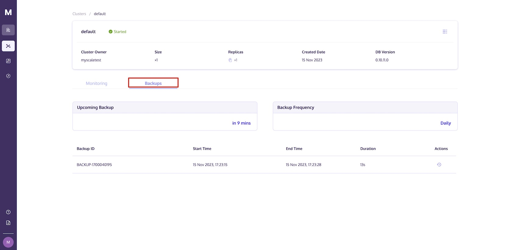
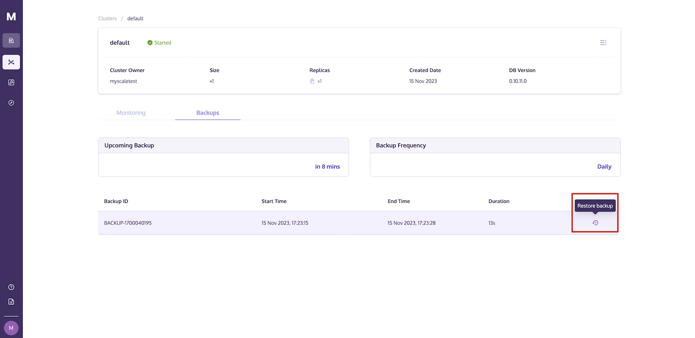
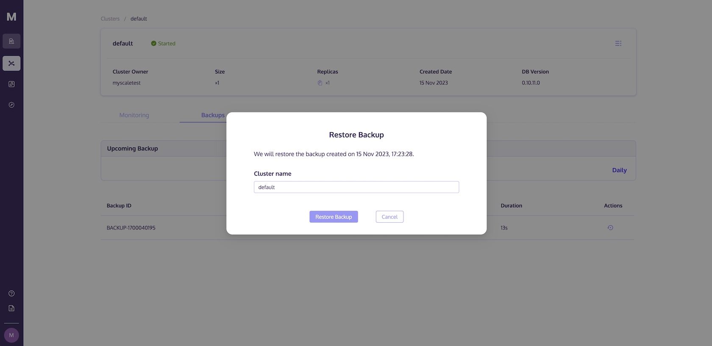
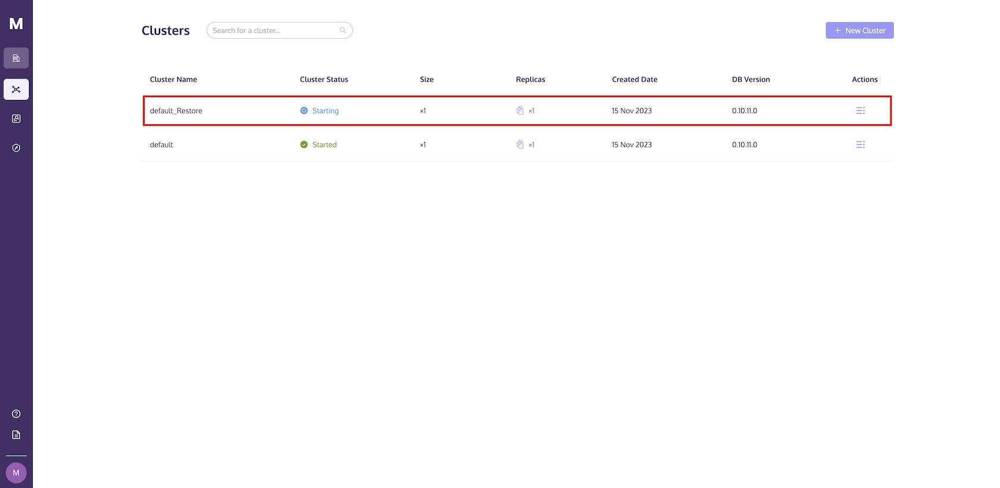

# Backup & Restore

The backup feature is designed to safeguard your valuable data and ensure its availability in the event of unforeseen circumstances. This guide will walk you through how to utilize the Backup & Restore functionality.

::: tip
Please note that the Backup feature is exclusively available for our Standard Plan users. If you are not already on the Standard Plan, we highly recommend upgrading to take advantage of this critical data protection feature.
:::

## Backup Plan

Your cluster automatically creates a full data backup every 24 hours. You can view or restore this backup by navigating to the "Backup" tab on the details page of the cluster. Follow these steps:

1. Sign in to MyScale.
2. Go to the cluster page, click on the desired cluster, and access the corresponding details page.
3. Click on the "Backup" tab.

::: tip
- Clusters under the Standard Plan will automatically enable the backup feature with a daily backup interval, and the backups will be stored in S3.
- We currently retain only the most recent backup. Older backups are automatically deleted once a new backup becomes available.
- Write operations executed during the backup process may not be included in the backup.
- Enable this feature by upgrading your database to version 0.10.11.0 or higher. This update is essential for activating backup and leveraging its protection. For more details, please refer to the [Updating the DB Version](updating-the-db-version.md).
:::

## Restore Backup

To restore a cluster backup, click on the "**Restore Backup**" icon. Next, provide the cluster name for the newly created cluster and then click "**Restore Backup**".

The new cluster will appear in the cluster list as "**Starting**" until it is ready for launch.

::: tip
Restore one cluster at a time for the same backup record. Wait for the previous restoration to finish before proceeding with a second cluster.
:::
