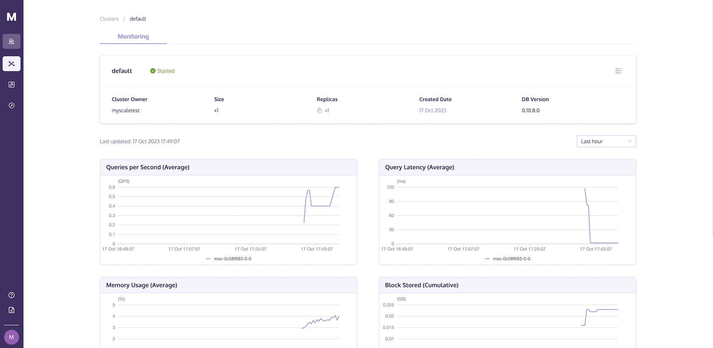

# Cluster Monitoring

This document explains how to monitor your cluster using the MyScale console.

To monitor the corresponding cluster you have created through the MyScale console, please follow the steps below:

1. Sign in to MyScale.
2. Navigate to the cluster page, click on the desired cluster, and access the corresponding details page to view usage.

You can view the Queries per Second, Query Latency, and Data Stored of the cluster by selecting Last hour, Last 24 hours, or Last week.
