# Clusters Management

MyScale supports the following operations for managing clusters:

- [Cluster Creation](#cluster-creation)
- [Cluster Configuration](#cluster-configuration)
- [Import Data](#import-data)
- [Connection Details](#connection-details)
- [Cluster Configuration Modification](#cluster-configuration-modification)
- [Change Cluster Password](#change-cluster-password)

<!-- - [Cluster IP Allow List](#cluster-ip-allow-list)
  - [Adding new IP addresses](#adding-new-ip-addresses)
  - [Deleting existing IP addresses](#deleting-existing-ip-addresses) -->

## Cluster Creation

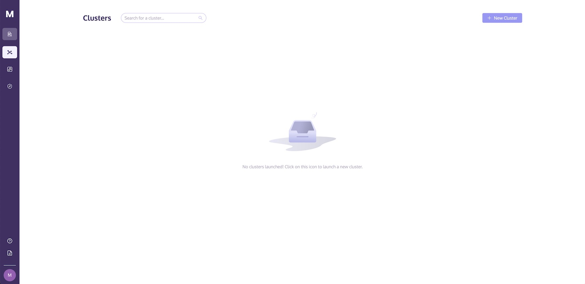

The cluster can be created by clicking on the **“+ New Cluster”** on the **Clusters** page. Whenever a Cluster is created, the Cluster will start automatically. 

A cluster needs to be started before being able to import data and execute queries within the cluster.

In the current version of MyScale, development plan users can only create one cluster. Please note that the cluster will be terminated if there is no activity for 7 days, and all data in the cluster will be deleted. For more details, please refer to the <a :href="$themeConfig.homeUrl + '/pricing/'" target="_blank" rel="noopener">Pricing Plan</a>.

## Cluster Configuration

MyScale allows you to choose a name for their cluster and supports modifying the idle period. To name your cluster, please enter a string of valid characters comprising of letters and numbers. The length of the string should be between 1 and 31 characters.

It is important to note that once there is no activity for the specified period, the cluster will transition to an idle state. If any requests are sent, your service will be resumed after a certain period of time.

<!-- This operation may only be performed by the organization’s owner or database admin. -->

## Import Data

After the cluster is created, it will start automatically. The cluster needs to be fully started before data can be imported into it within the cluster, as shown in the following diagram:

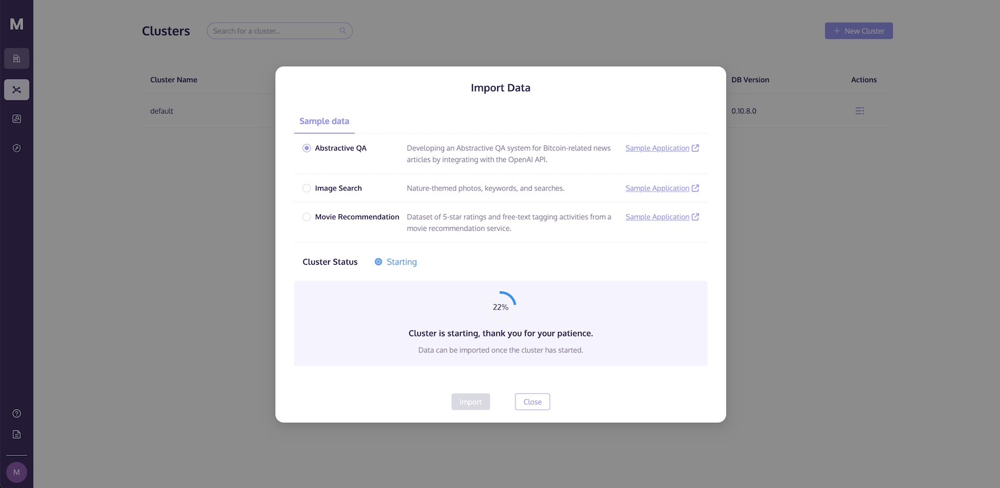 

To facilitate your exploration of MyScale, we have provided sample datasets along with their corresponding execution commands. 
Select the sample dataset you wish to import and, once the cluster is in the **Started** state, you may commence importing the data as illustrated in the diagram below:

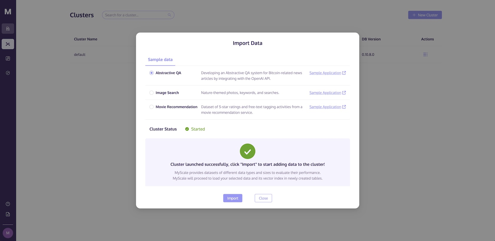 

Once the import process is complete, you may begin testing query execution. Simply copy the sample code located in the SQL tab, and execute it in the SQL Workspace.

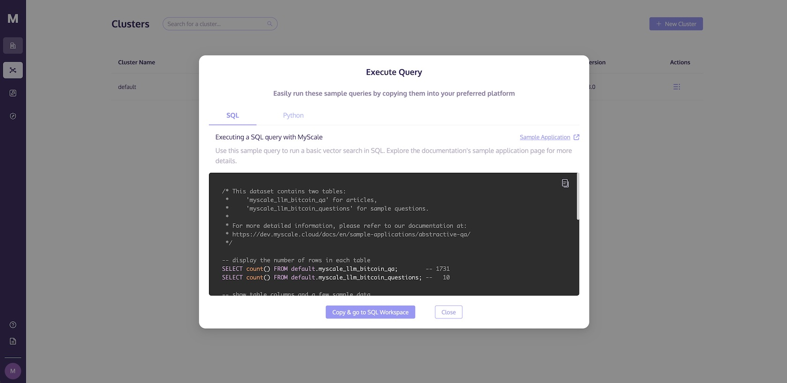 

Alternatively, you may switch to the Python tab, copy the code, and utilize the Python client to access MyScale and execute queries.

 

If you would like to try other publicly available datasets on the internet or your personal collection of data, please refer to the [SQL Reference](../sql-reference/index.md) and [Vector Search](../vector-search.md).

## Connection Details

Apart from [SQL Workspace](../sql-execution/index.md), MyScale offers various connectivity options as below:
- [Python Client](../python-client.md)
- [Node.js Client](../nodejs-client.md)
- [Go Client](../go-client.md)
- [JDBC Driver](../jdbc-driver.md)
- [HTTPS Interface](../https-interface.md)

To access MyScale via the above methods, you will need the necessary connection information such as `MYSCALE_CLUSTER_URL`, `YOUR_USERNAME`, and `YOUR_CLUSTER_PASSWORD`. You can find the **Connection Details** button in the **Action** column of your cluster list.

 

After clicking on the **Connection Details** button, you will see the necessary code required to access MyScale. You can switch tabs based on the tool you choose to use, and copy the corresponding code to connect to the new service.
- Python

 

- Node.js

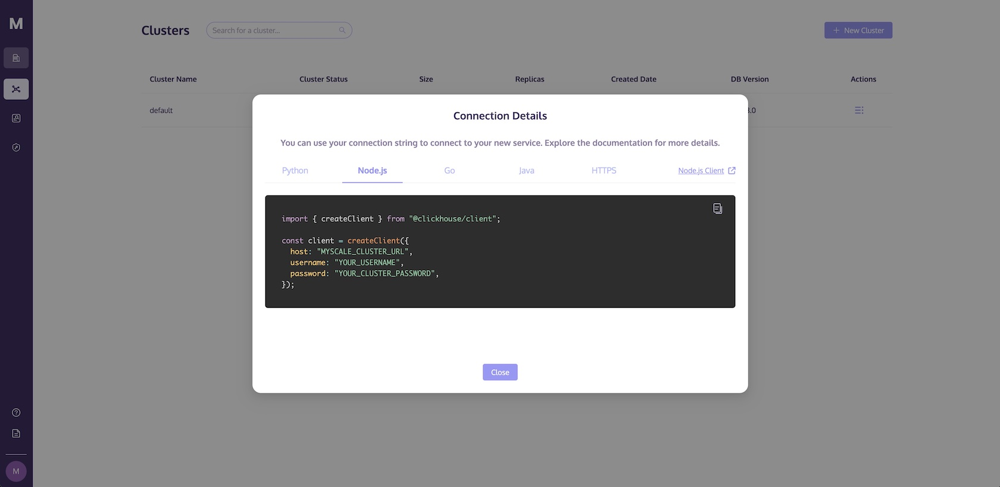 

- Go

 

- Java

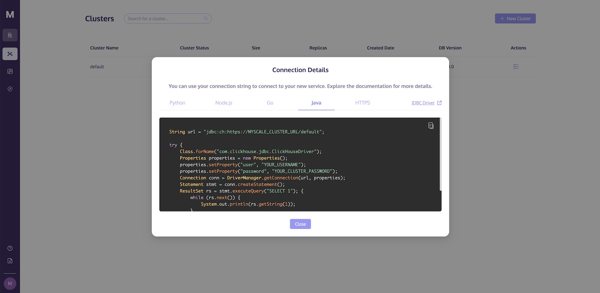 

- HTTPS

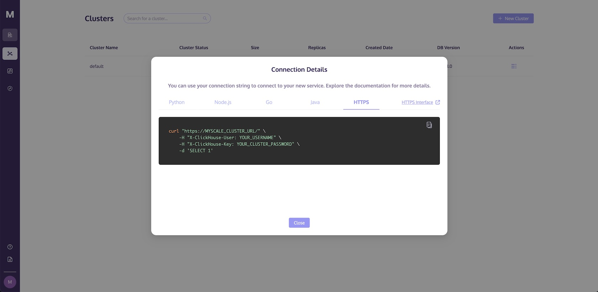 

## Cluster Configuration Modification

MyScale provides support for users to modify the configuration of previously created clusters. Below are some points to consider when modifying clusters:

- Development Plan: Cluster name and idle period modification supported.
- Standard Plan: Cluster name, idle period, size, and replicas modification are supported.
- Modification of size or replicas is only supported when the cluster is in the "started" or "idle" state.
- Cluster size can only be increased and is not allowed to be decreased.
- After modifying the size, clusters need time to scale. During this period, the ability of users to execute statements depends on the number of replicas in the cluster.
  - If the original cluster has only one replica, users will be unable to execute statements.
  - If the original cluster has more than one replica, users can perform read operations normally, but write operations won't be possible.
- After modifying the replicas, cluster needs time to scale. During this period, only SELECT statements are supported.

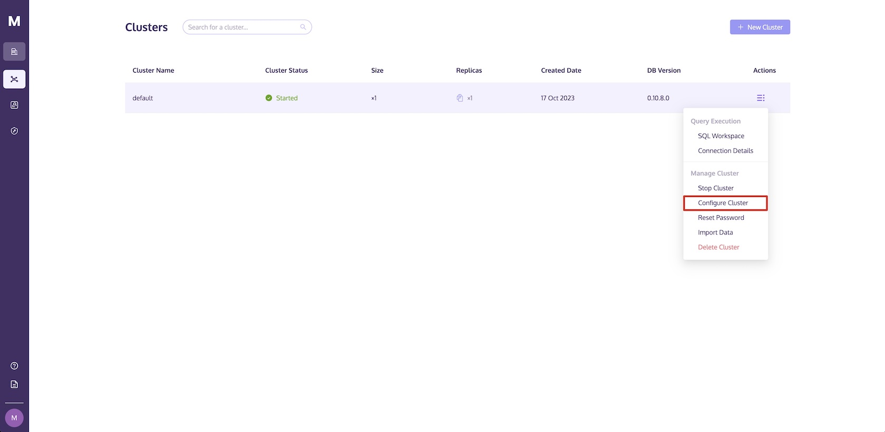 

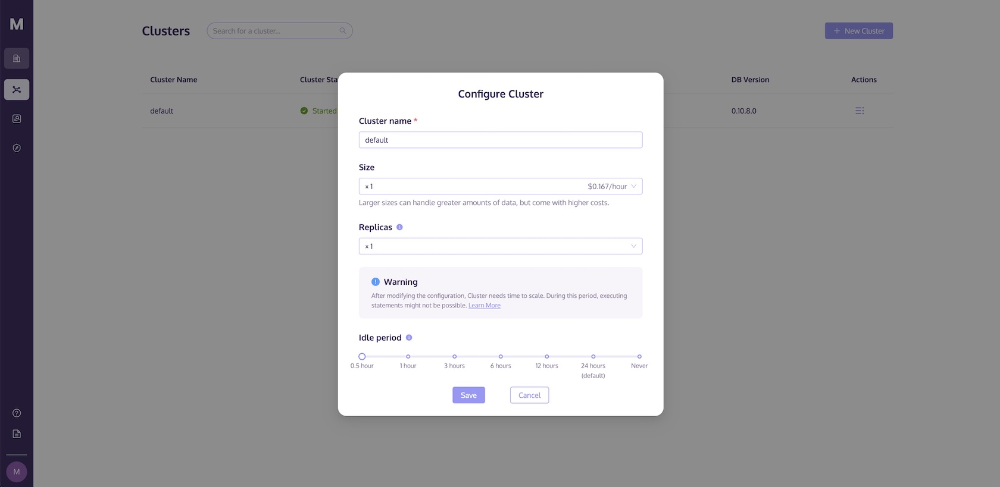 

## Reset Cluster Password

If you wish to reset the cluster password, you can locate the **Reset Cluster** button in the **Action** column of your cluster list.

::: tip
Resetting the cluster password is only supported for users with the Organization Owner and Admin roles.
:::

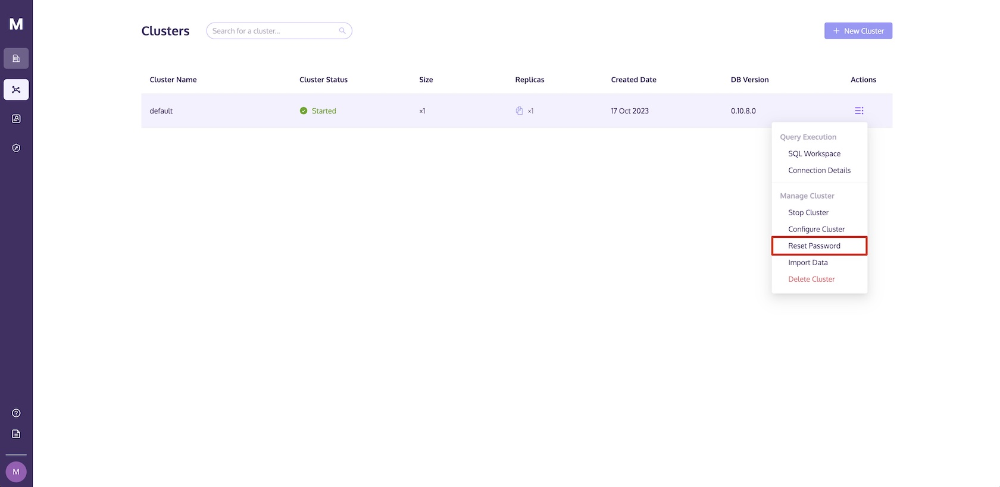 

You can click the **Reset** button.

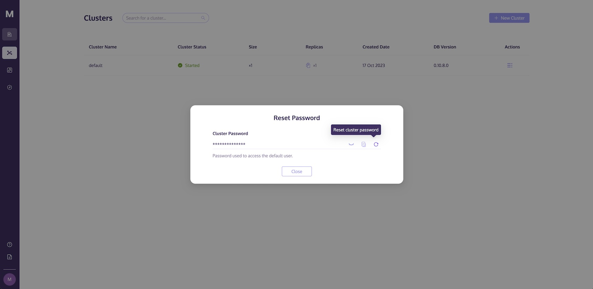 

If you are certain about resetting the cluster password, please click on the **Reset** button.

::: warning NOTE
Please note that once the new password is generated, users currently accessing the Cluster using the default user will experience a temporary service interruption and will need to use the new password to reconnect. 
:::

<!-- ## Cluster IP Allow List

An IP allow list lets organization have control over the external users that may connect to the organization’s cluster. Whenever a cluster is created, no IP addresses are assigned to it. This allows all external users to connect to the cluster.

To restrict certain IP addresses to use the cluster, an IP allow list needs to be created.

### Adding new IP addresses

This can be performed by clicking on the **“+”** icon on the **"IP Allow List"** subpage.

In the current version of MyScale, only IPv4 addresses that follow CIDR notation are supported. Users may choose to key in IP addresses, or paste a list of row-separated IP addresses for up to 1,000 characters.

If there are invalid IP addresses being added to the cluster, the user will be prompted to check for any invalid IP addresses before proceeding to add them to the IP allow list.

### Deleting existing IP addresses

 

To delete existing IP addresses, users may choose to select a single IP address, or select that page’s IP addresses for deletion. -->
