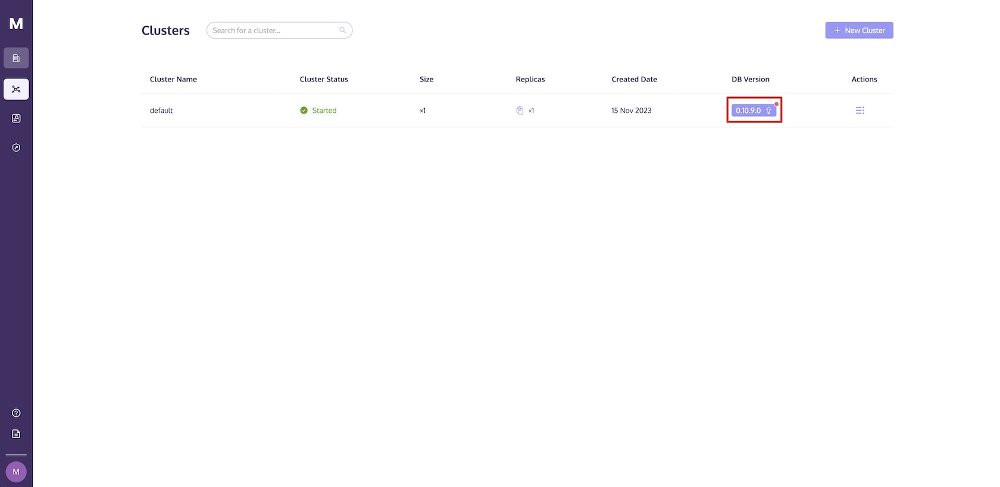

# Updating the DB Version

Updating the DB version can enhance performance, introduces new features, and fixes bugs in the cluster. This article will guide you through the update process and outline the precautions you should take into account.

## Precautions

- Downgrading is not supported once the DB version is updated;
- Every time you update the DB version, it will automatically update to the latest version;
- You can only update the DB version when the cluster is in the 'Started,' 'Stopped,' or 'Idle' state;
- Please note that during the DB version update, read and write operations will be unavailable when the cluster is in the 'Stopped' state;
- If the cluster is in the "Started" or "Idle" state during the upgrade, a single replica cluster may experience service interruptions, and read/write operations may temporarily fail;
- If the cluster is in the "Started" or "Idle" state during the upgrade, write operations may temporarily fail for a multi-replica cluster, but SELECT statements will still work normally;
- The upgrade is applicable for clusters with DB version 0.9.2.0 or higher, including version 0.9.2.0.

For DB versions below 0.9.2.0, automatic updates are not available. To use the latest DB version, create a new cluster and migrate your data. If you wish to export your database data, please refer to [Exporting Results to Local Disk](../sql-execution/index.md#exporting-results-to-local-disk) or [Exporting Data to S3 Using Insert Into](../sql-reference/insert-into-queries.md#exporting-data-to-s3-using-insert-into).

For any inquiries regarding this matter, please <a :href="$themeConfig.homeUrl + '/contact/'" target="_blank" rel="noopener">Contact Us</a>.

## Update Procedure

When the DB version of a cluster is not the latest, an "Update" button will appear in the cluster list, as shown in the following illustration.

By clicking the "Update" button, you can initiate the upgrade process.
