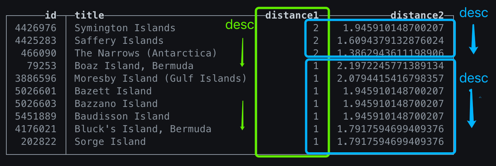

# Hybrid Search in MyScale

This guide introduces the benefits of using hybrid search to improve your text search experience and provides instructions on implementing it with MyScale.

## Why Do You Need Hybrid Search?

Vector search can capture semantic relationships between words, handle complex and ambiguous expressions in natural language, and support multi-modal and cross-modal searches. While powerful and efficient for many tasks, vector search may need help correctly understanding the semantics for short-text searches.

Why is hybrid search necessary?

Short-text queries often need more information and context to produce accurate and highly relevant results; instead, returning low-precision results. For instance, in cases where users need to perform comprehensive, precise matches for phrases like goods names, product tags, and clothing sizes, traditional search (not vector search) technologies based on term-matching, such as *"BM25"* and *"TF-IDF"*, are a more suitable option.

Hybrid search, a combination of semantic search and traditional term matching, overcomes the challenges of insufficient semantic coverage in vectorized documents. For example, if you are searching for a screwdriver in a hardware store's database using vector search, the result set will include all the options stored in the database. However, term matching is more useful when looking for a specific screwdriver that precisely matches the model, length, and material.

## Using Hybrid Search in MyScale

This tutorial will show you how to use hybrid search in MyScale. To complete this tutorial, you only need a MyScale account and a Python3 environment on your local machine. Log into MyScale and create a cluster, which you will use throughout this tutorial.

::: tip
Instructions on creating a cluster are in our [quickstart documentation](https://myscale.com/docs/en/quickstart/).
:::

Once you have created a cluster, the next steps are as follows:

* [Create a table in MyScale](#create-a-table-in-myscale)
* [Import data from Amazon S3](#import-data-from-amazon-s3)
* [Create a vector index](#create-a-vector-index)
* [Short-text search](#short-text-search)
  * [Do the preliminary work](#preliminary-work)
  * [Conduct a vector search](#vector-search)
  * [Explore hybrid search options](#hybrid-search)

## Create a Table in MyScale

Execute the following SQL statement to create the table `rd0` in MyScale's SQL Workspace:

```sql
CREATE TABLE default.rd0
(
    `id` UInt64,
    `body` String,
    `title` String,
    `url` String,
    `body_vector` Array(Float32),
    CONSTRAINT check_length CHECK length(body_vector) = 384
)
ENGINE = MergeTree
ORDER BY id;
```

You can use the SQL statement below to check if the table has been created:

```sql
SHOW tables;
```

If the table was created, this SQL statement will return the following result set:

| name |
| ---  |
| rd0  |

## Import Data From Amazon S3

We have improved the [Wikipedia abstract dataset](https://s3.amazonaws.com/benchmarks.redislabs/redisearch/datasets/enwiki-abstract/enwiki-latest-abstract.xml) hosted by RedisSearch by including vector data. We used `sentence-transformers/all-MiniLM-L6-v2` to convert the text in the `body` column into 384-dimensional vectors. These vectors are stored in the `body_vector` column, and cosine is used to calculate the distance between them.

::: tip
For further information on how to use all-MiniLM-L6-v2, see [HuggingFace's documentation](https://huggingface.co/sentence-transformers/all-MiniLM-L6-v2).
:::

The final dataset, [wiki_abstract_with_vector.parquet](https://myscale-datasets.s3.ap-southeast-1.amazonaws.com/wiki_abstract_with_vector.parquet), is 8.2GB and contains 5,622,309 entries. You can preview the content of this dataset below. There is no need to download it to your local machine, as we can import it directly into MyScale through S3.

| id  | body | title | url | body_vector |
| --- | ---  | ---   | --- | ---         |
| ... | ...  | ...   | ... | ...         |
| 77  | Jake Rodkin is an American .... and Puzzle Agent. | Jake Rodkin | <https://en.wikipedia.org/wiki/Jake_Rodkin> | [-0.081793934,....,-0.01105572] |
| 78  | Friedlandpreis der Heimkehrer is ... of Germany. | Friedlandpreis der Heimkehrer | <https://en.wikipedia.org/wiki/Friedlandpreis_der_Heimkehrer> | [0.018285718,...,0.03049711] |
| ... | ...  | ...   | ... | ...          |

Execute the following SQL command in the SQL Workspace to import this data.

```sql
INSERT INTO default.rd0 SELECT * FROM s3('https://myscale-datasets.s3.ap-southeast-1.amazonaws.com/wiki_abstract_with_vector.parquet','Parquet');
```

::: warning Note
The estimated time for the data import is approximately 10 minutes.
:::

Run the following SQL statement to check when the imported data has reached 5,622,309 rows.

```sql
SELECT COUNT(*) FROM default.rd0;
```

::: tip
You can run this SQL statement more than once until the data has finished importing.
:::

## Create a Vector Index

The first part of creating a vector index is to improve the vector search performance by merging the table's data parts into a single part before adding the vector index to this table.

### Improve Vector Search Performance

To optimize  the table (improve vector search performance), execute the following SQL command in your SQL Workspace:

```sql
OPTIMIZE TABLE default.rd0 FINAL;
```

This command might take a while to execute.

Run the following SQL statement to check if this table's data parts have been condensed into 1.

```sql
SELECT COUNT(*) FROM system.parts WHERE table='rd0' AND active=1;
```

If data parts were compressed into 1, this SQL statement will return the following result set:

| count() |
| ---     |
| 1       |

### Create the Vector Index

Run the following statement to create a vector index:

::: warning Note
[MSTG](./vector-search.md#mstg-parameters) is a vector index developed by MyScale.
:::

```sql
ALTER TABLE default.rd0 ADD VECTOR INDEX RD0_MSTG body_vector
TYPE MSTG('metric_type=Cosine');
```

Creating an index requires time. Execute the following SQL statement to check on the index creation's progress. If the status column returns *Built*, the index has been successfully created. While the index is still building, the status column should return *InProgress*.

```sql
SELECT * FROM system.vector_indices;
```

## Perform Vector Search and Hybrid Search

This how-to guide describes both the vector and hybrid searches.

However, before we proceed, we must do some preliminary work.

### Preliminary Work

Use the following Python code in your app to achieve the following:

* Modify the host, username, and password to connect to your MyScale cluster.
* Import the transformer all-MiniLM-L6-v2 model to convert text into vectors.
* Create a simple output function to view the SQL execution results.

```python
import clickhouse_connect
from prettytable import PrettyTable
from sentence_transformers import SentenceTransformer

# Use transfromer all-MiniLM-L6-v2
model = SentenceTransformer('sentence-transformers/all-MiniLM-L6-v2')

# MyScale information
host = "your_endpoint"
port = 443
username = "your_username"
password = "your_password"
database = "default"
table = "rd0"

# Init MyScale client
client = clickhouse_connect.get_client(host=host, port=port,
                                       username=username, password=password)

# Use a table to output your content
def print_results(result_rows, field_names):
    x = PrettyTable()
    x.field_names = field_names
    for row in result_rows:
        x.add_row(row)
    print(x)
```

### Vector Search

As the next Python code snippet describes, the vector search  process, also known as a neural search, is as follows:

* Use the model `all-MiniLM-L6-v2` to convert the text "history about television news service" into an embedding vector.
* Use a vector search to return the dataset's top 5 most similar Wikipedia pages.

```python
# trying vector search
sentence = "history about television news service"
sentence_embedding = model.encode([sentence])[0]

sentence_result = client.query(query=f"SELECT id, title, body, distance('alpha=1')"
                                     f"(body_vector, {list(sentence_embedding)}) AS distance "
                                     f"FROM {database}.{table} ORDER BY distance ASC LIMIT 5")

print_results(sentence_result.result_rows, ["ID", "Title", "Body", "Distance"])
```

The following table describes the search results.

| ID      | Title                                | Body | Distance |
| ---     | ---                                  | ---  | ---      |
| 2341540 | Television news in the United States | Television news in the United States has evolved over many years. It has gone from a simple 10- to 15-minute format in the evenings, to a variety of programs and channels. | 0.3019871711730957 |
| 4741891 | United States cable news             | Cable news channels are television channels devoted to television news broadcasts, with the name deriving from the proliferation of such networks during the 1980s with the advent of cable television. In the United States, early networks included CNN in 1980, Financial News Network (FNN) in 1981 and CNN2 (now HLN) in 1982. | 0.3059382438659668 |
| 4555265 | News and Views (TV series)           | News and Views was an early American evening news program. Broadcast on ABC from 1948 to 1951, it was ABC's first evening news program and one of the first such programs on any television network; Both CBS and NBC also initiated their evening news programs (respectively CBS Television News and Camel News Caravan, called Camel Newsreel Theatre at first) that same year, both debuting a few months before the first broadcast of News and Views on August 11, 1948. | 0.3165452480316162 |
| 185179  | MediaTelevision                      | Media Television was a Canadian television newsmagazine series, which aired weekly on Citytv from 1991 to 2004. It was also syndicated internationally, airing in over 100 countries around the world at some point during its run. | 0.32938069105148315 |
| 1426832 | News service                         | News service may refer to: | 0.3431185483932495 |

### Vector Search Limitations

From the description above, it is clear that using a pure vector search for short-text phrases has limitations.

For instance: let's convert the phrase "BGLE Island" into a vector, conduct a vector search, and look at the results.

```python
terms = "BGLE Island"
terms_embedding = model.encode([terms])[0]

stage1 = f"SELECT id, title, body, distance('alpha=1')" \
         f"(body_vector,{list(terms_embedding)}) AS distance FROM {database}.{table} " \
         f"ORDER BY distance ASC LIMIT 5"

sentence_result = client.query(query=stage1)
print_results(client.query(query=stage1).result_rows, ["ID", "Title", "Body", "Distance"])
```

Here are the top five search results:

| ID      | Title                     | Body                           | Distance            |
| ---     | ---                       | ---                            |---                  |
| 2625112 | Bligh Island (Alaska)     | Bligh Island}}                 | 0.227422833442688   |
| 2625120 | Bligh Island (Canada)     | Bligh Island}}                 | 0.227422833442688   |
| 4894492 | Hedley (band)             | Island                         | 0.3269183039665222  |
| 4708096 | Blueberry Island          | Blueberry Island may refer to: | 0.3446136713027954  |
| 5519217 | Brown Island (Antarctica) | Brown Island}}                 | 0.35350120067596436 |

::: warning Note
When looking at these results, it is evident that the top 5 results do not include the word "BGLE".
:::

### Hybrid Search

Let's use a hybrid search to improve result accuracy instead of relying solely on vector search for shorter phrases or single words. For example, for the term "BGLE Island," we will follow a two-stage approach:

* Use a vector search to identify the top 200 candidates
* Use MyScale's built-in functions and a simplified TF-IDF (term frequency-inverse document frequency) method to reorganize and refine these results

#### Use a Vector Search

The following code snippet describes how to conduct a vector search to identify the top 200 results:

```python
# Stage 1. Vector Recall
terms = "BGLE Island"
terms_embedding = model.encode([terms])[0]
terms_pattern = [f'(?i){x}' for x in terms.split(' ')]

stage1 = f"SELECT id, title, body, distance('alpha=1')" \
         f"(body_vector,{list(terms_embedding)}) AS distance FROM {database}.{table} " \
         f"ORDER BY distance ASC LIMIT 200"
```

#### Helper Functions

Before conducting a hybrid search, we must understand the following two functions provided by MyScale:

**`multiMatchAllindices()`**:
This function returns the starting index of all substrings in a string that matches the specified regular expressions. It takes two parameters, the source string and a list of regular expressions.

::: tip
This index starts from 1 and not 0.
:::

::: warning Note
For more information, refer to the ClickHouse documentation on [`multiMatchAllIndices`](https://clickhouse.com/docs/en/sql-reference/functions/string-search-functions#multimatchallindices).
:::

For example:

```sql
SELECT multiMatchAllIndices(
        'He likes to eat tomatoes.',
        ['(?i)\\blike\\b', '(?i)likes', '(?i)Tomatoes']) AS result
```

When executed, this SQL statement will return the following result:

| result |
| ---    |
| [2, 3] |

**`countMatches()`**:
This function counts the number of specified substrings in a string. It takes two parameters, the source string and a regular expression using re2 syntax.

::: warning Note
For more information, refer to the ClickHouse documentation on [`countMatches`](https://clickhouse.com/docs/en/sql-reference/functions/string-search-functions#countmatches).
:::

For example:

```sql
SELECT countMatches('He likes to eat tomatoes', '(?i)Tomatoes') AS result
```

When executed, this SQL statement will return the following result:

| result |
| ---    |
|   1    |

#### Sort the Search Results

As the following Python code snippet highlights, this next stage sorts these search results twice (term reranking):

* Sort these results based on their popularity. The more search hits a result has, the higher its ranking.
* Sort these results again based on the number of search hits (term frequency). The higher the term frequency, the higher the ranking.

::: tip
We use a simplified TF-IDF to sort these results a second time.
:::

```python
# Stage 2. Term Reranking
stage2 = f"SELECT tempt.id, tempt.title,tempt.body, distance1, distance2 FROM ({stage1}) tempt " \
         f"ORDER BY length(multiMatchAllIndices(arrayStringConcat([body, title], ' '), {terms_pattern})) " \
         f"AS distance1 DESC, " \
         f"log(1 + countMatches(arrayStringConcat([title, body], ' '), '(?i)({terms.replace(' ', '|')})')) " \
         f"AS distance2 DESC limit 10"
sentence1_result = client.query(query=stage2)
print_results(sentence1_result.result_rows, ["ID", "Title", "Body", "distance1", "distance2"])
```

The search results are as follows:

| ID       | Title                         | Body | distance1 | distance2 |
| ---      | ---                           | ---  | ---       | ---       |
| 4426976  | Symington Islands             | Symington Islands () is a group of small islands lying west-northwest of Lahille Island, in the Biscoe Islands. Charted by the British Graham Land Expedition (BGLE) under Rymill, 1934-37.                                                                                                        | 2         | 1.945910148700207  |
| 4425283  | Saffery Islands               | Saffery Islands () is a group of islands extending west from Black Head, off the west coast of Graham Land. Charted by the British Graham Land Expedition (BGLE) under Rymill, 1934–37.                                                                                                           | 2         | 1.6094379132876024 |
| 466090   | The Narrows (Antarctica)      | The Narrows () is a narrow channel between Pourquoi Pas Island and Blaiklock Island, connecting Bigourdan Fjord and Bourgeois Fjord off the west coast of Graham Land. It was discovered and given this descriptive name by the British Graham Land Expedition (BGLE), 1934–37, under Rymill. | 2         | 1.3862943611198906 |
| 79253    | Boaz Island, Bermuda          | Boaz Island, formerly known as Gate's Island or Yates Island, is one of the six main islands of Bermuda. It is part of a chain of islands in the west of the country that make up Sandys Parish, lying between the larger Ireland Island and Somerset Island, and is connected to both by bridges. | 1         | 2.1972245771389134 |
| 3886596  | Moresby Island (Gulf Islands) | Moresby Island is one of the Gulf Islands of British Columbia, located on the west side of Swanson Channel and east of the southern end of Saltspring Island. It is not to be confused with Moresby Island, the second largest of the Queen Charlotte Islands off the north coast of BC.           | 1         | 2.0794415416798357 |
| 5026601  | Bazett Island                 | Bazett Island is a small island close south of the west end of Krogh Island, in the Biscoe Islands. It was mapped from air photos by the Falkland Islands and Dependencies Aerial Survey Expedition (1956–57), and named by the UK Antarctic Place-Names Committee for Henry C.                    | 1         | 1.945910148700207  |
| 5026603  | Bazzano Island                | Bazzano Island () is a small island lying off the south end of Petermann Island, between Lisboa Island and Boudet Island in the Wilhelm Archipelago. It was discovered and named by the French Antarctic Expedition, 1908–10, under Jean-Baptiste Charcot.                                          | 1         | 1.945910148700207  |
| 5451889  | Baudisson Island              | Baudisson Island is an island of Papua New Guinea, located south of New Hanover Island and west of the northern part of New Ireland. It is located between Selapiu Island and Manne Island.                                                                                                        | 1         | 1.945910148700207  |
| 4176021  | Bluck's Island, Bermuda       | Bluck's Island (formerly Denslow['s] Island, Dyer['s] Island) is an island of Bermuda. It lies in the harbor of Hamilton in Warwick Parish.                                                                                                                                                        | 1         | 1.7917594699409376 |
| 202822   | Sorge Island                  | Sorge Island () is an island lying just south of The Gullet in Barlas Channel, close east of Adelaide Island. Mapped by Falkland Islands Dependencies Survey (FIDS) from surveys and air photos, 1948-59.                                                                                          | 1         | 1.7917594699409376 |

The two sorting operations are demonstrated below:



### An Explanation of TF-IDF

TF-IDF is a statistical measure used to assess the relevance of a word in a collection of documents. It achieves this by multiplying two metrics: the number of times a word appears in a specific document and this word's inverse (opposite) document frequency across all documents in the set.

For example:

$$\text{TF-IDF}(t, d)=\frac{|D|*\log(1+f_{t,d})}{\log(|\{d\in D: t\in d\}|)}\  \qquad \forall t\in T$$

In this example, $T=\{t_1, t_2,...\}$ is the set of words, and $f_{T,d}$​ is the frequency of all words/terms appearing in the document $d$. The standard TF-IDF calculation calculates the term frequency of each word individually to measure relevance:

$$\text{score}=\sum_{t\in T}\text{TF-IDF}(t,d)$$

The next step is calculating a different Inverse Document Frequency for each word. If all words are regarded as a class, the calculation of TF-IDF can be simplified as follows:

$$\text{TF-IDF}'(T, d)=\frac{|D|*\log(1+f_{T,d})}{\log(|\{d\in D: T\subset d\}|)}$$

Where $f_{T,d} = \sum_{t'\in T} f_{t', d}$​  

When we use the simplified TF-IDF calculation, we use the same Inverse Document Frequency (IDF) as the denominator to calculate the relevance of all term frequencies. Therefore, these IDF denominators that do not affect the sorting results can be eliminated, so the final simplified TF-IDF becomes a form of TF:

$$\text{TF-IDF}'(T,d) = \log(1+f_{T,d})$$
