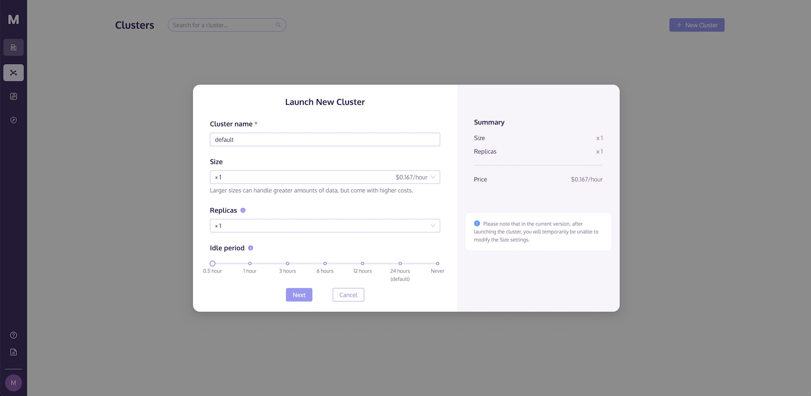
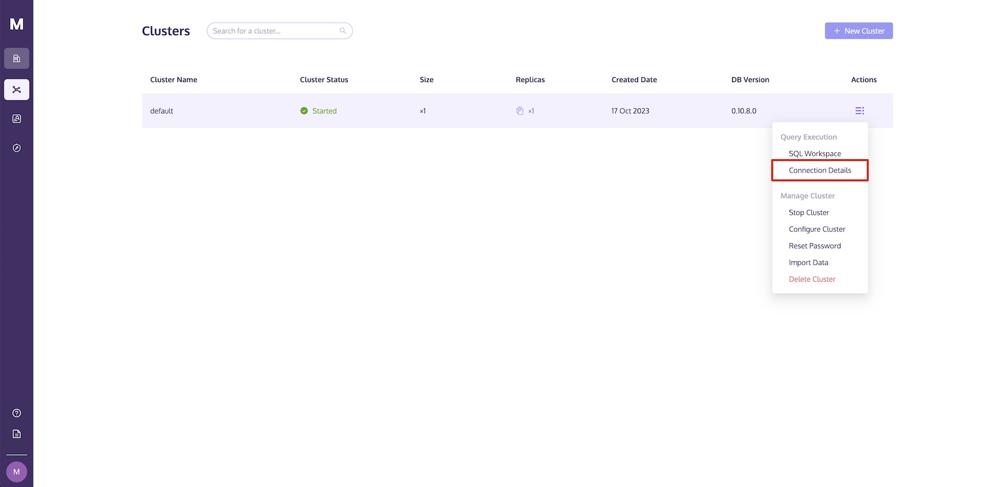
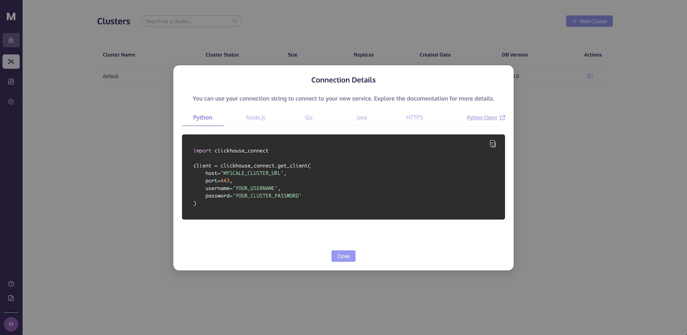
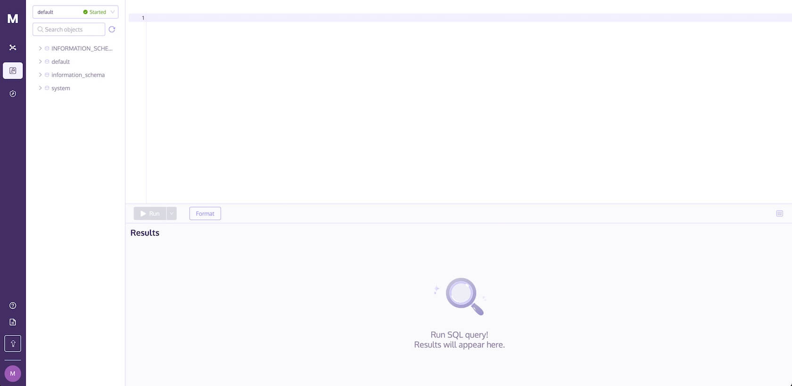

# Quickstart

<a href="https://colab.research.google.com/github/myscale/examples/blob/main/categorical-search.ipynb" style="padding-left: 0.5rem;"></a>
<a href="https://github.com/myscale/examples/blob/main/categorical-search.ipynb" style="padding-left: 0.5rem;"></a>

This guide will show you how to launch a cluster, import data, and execute SQL queries in a few simple steps. More information on other developer tools, such as the [Python Client](./python-client.md), can be found in the Developer Tools section.

## How to Launch Your First Cluster



Before performing any data operations, you need to launch a cluster. The **Clusters** page lets you create a cluster and configure computing and storage resources to meet your requirements.

Follow these steps to launch a new cluster:

* Go to the **Clusters** page and click the **+New Cluster** button to launch a new cluster.
* Name your cluster.
* Click **Launch** to run the cluster.

::: tip
The development tier of MyScale is limited to the default configuration and does not support multiple replicas. Refer to the [Changing Your Billing Plan](./account-management/billing.md#changing-your-billing-plan) section and upgrade to the standard plan for a more powerful configuration.
:::

## Environment Setup

You have the option of connecting to a MyScale database using one of the following developer tools:

* [Python](./python-client.md)
* [Node.js](./nodejs-client.md)
* [Go](./go-client.md)
* [JDBC](./jdbc-driver.md)
* [HTTPS](./https-interface.md)

However, let's use Python to get started.

### Using Python

Before getting started with Python, you need to install the [ClickHouse client](https://clickhouse.com/docs/en/integrations/language-clients/python/intro/), as described in the following shell script:

```bash
pip install clickhouse-connect
```

Once the ClickHouse client has been installed successfully, the next step is to connect to your MyScale cluster from within a Python app by providing the following details:

* Cluster host
* Username
* Password

To find these details, navigate to the MyScale Clusters page, click the **Action** dropdown link, and select **Connection Details**.



As seen in the following image, a **Connection Details** dialog will display with the necessary code required to access MyScale. Click on the copy icon to copy the corresponding code and paste it into your Python app.



::: tip
See [Connection Details](./cluster-management/index.md#connection-details) for more information on connecting to your MyScale cluster.
:::

<!-- 
```python
import clickhouse_connect

# initialize client
# note that you can retrieve your CLUSTER_HOST from your CLUSTER_URL, formatted as "https://{HOST}:{PORT}"
client = clickhouse_connect.get_client(host='YOUR_CLUSTER_HOST', port=443, username='YOUR_USERNAME', password='YOUR_CLUSTER_PASSWORD')
``` -->

### Using the MyScale Console

To use the MyScale console to import data into your database and to run queries, navigate to the **SQL Workspace** page. Your cluster will be selected automatically, as shown below:



## How to Import Data into the Database

Follow these steps to import data into MyScale:

* [Create a table](#create-a-table)
* [Insert data into the table](#insert-data-into-the-table)
* [Build a vector index](#build-a-vector-index)

### Create a Table

Creating a database table in MyScale before importing any data is mandatory.

::: tip
To learn more, navigate to the document describing how to [Create a Database](./sql-reference/create-queries.md#create=database) and how to [Create a Table](./sql-reference/create-queries.md#create-table) in the [SQL Reference](./sql-reference/index.md) section.
:::

Using the following code samples, let's write a SQL statement (both in Python and SQL) to create a new table named `default.myscale_categorical_search`.

<CodeSwitcher :languages="{python:'Python',sql:'SQL'}">
<template v-slot:python>

```python
# Create a table with 128 dimensional vectors.
client.command("""
CREATE TABLE default.myscale_categorical_search
(
    id    UInt32,
    data  Array(Float32),
    CONSTRAINT check_length CHECK length(data) = 128,
    date  Date,
    label Enum8('person' = 1, 'building' = 2, 'animal' = 3)
)
ORDER BY id""")
```

</template>
<template v-slot:sql>

```sql
CREATE TABLE default.myscale_categorical_search
(
    id    UInt32,
    data  Array(Float32),
    CONSTRAINT check_length CHECK length(data) = 128,
    date  Date,
    label Enum8('person' = 1, 'building' = 2, 'animal' = 3)
) ORDER BY id;
```

</template>
</CodeSwitcher>

### Insert Data Into the Table

::: tip
MyScale supports data imports from Amazon s3 and other cloud services using s3-compatible APIs. See the [s3 Table Function](./sql-reference/insert-into-queries.md#using-the-s3-table-function-with-insert-into) for more information on importing data from Amazon s3.
<!--跳转至 SQL Reference 中介绍 s3 import 方法内容，待 SQL Reference 补充-->
:::

As described in the following code snippets, let's use SQL to import data into the `default.myscale_categorical_search` table.

Supported file formats include:

* [`CSV`](https://clickhouse.com/docs/en/interfaces/formats/#csv)
* [`CSVWithNames`](https://clickhouse.com/docs/en/interfaces/formats/#csvwithnames)
* [`JSONEachRow`](https://clickhouse.com/docs/en/interfaces/formats/#jsoneachrow)
* [`Parquet`](https://clickhouse.com/docs/en/interfaces/formats/#data-format-parquet)

::: tip
See [Formats for Input and Output Data](https://clickhouse.com/docs/en/interfaces/formats/) for a detailed description of all supported formats.
:::

<CodeSwitcher :languages="{python:'Python',sql:'SQL'}">
<template v-slot:python>

```python
client.command("""
INSERT INTO default.myscale_categorical_search
    SELECT * FROM s3(
        'https://d3lhz231q7ogjd.cloudfront.net/sample-datasets/quick-start/categorical-search.csv',
        'CSVWithNames',
        'id UInt32, data Array(Float32), date Date, label Enum8(''person'' = 1, ''building'' = 2, ''animal'' = 3)'
    )""")
```

</template>
<template v-slot:sql>

```sql
INSERT INTO default.myscale_categorical_search
    SELECT * FROM s3(
        'https://d3lhz231q7ogjd.cloudfront.net/sample-datasets/quick-start/categorical-search.csv',
        'CSVWithNames',
        'id UInt32, data Array(Float32), date Date, label Enum8(''person'' = 1, ''building'' = 2, ''animal'' = 3)'
    );
```

</template>
</CodeSwitcher>

### Build a Vector Index

In addition to creating traditional indexes on structured data, you can also create a [Vector Index](vector-search.md) in MyScale for vector embeddings. Follow this step-by-step guide to see how:

#### Create MSTG Vector Index

As the following code snippets show, the first step is to create an MSTG vector index, a vector index using our proprietary algorithm, MSTG.

<CodeSwitcher :languages="{python:'Python',sql:'SQL'}">
<template v-slot:python>

```python
client.command("""
ALTER TABLE default.myscale_categorical_search
    ADD VECTOR INDEX categorical_vector_idx data
    TYPE MSTG
""")
```

</template>
<template v-slot:sql>

```sql
ALTER TABLE default.myscale_categorical_search
    ADD VECTOR INDEX categorical_vector_idx data
    TYPE MSTG;
```

</template>
</CodeSwitcher>

::: tip
The index's build time depends on the size of your data import.
:::

#### Check Vector Index Build Status

The following code snippets describe how to use SQL to check the vector index's build status.

<CodeSwitcher :languages="{python:'Python',sql:'SQL'}">
<template v-slot:python>

```python
# Query the 'vector_indices' system table to check the status of the index creation.
get_index_status="SELECT status FROM system.vector_indices WHERE table='myscale_categorical_search'"

# Print the status of the index creation.  The status will be 'Built' if the index was created successfully.
print(f"index build status is {client.command(get_index_status)}")
```

</template>
<template v-slot:sql>

```sql
SELECT database, table, name, type, status FROM system.vector_indices;
```

</template>
</CodeSwitcher>

The output is seen in the following examples:

<CodeSwitcher :languages="{python:'Python',sql:'SQL'}">
<template v-slot:python>

```python
index build status is Built
```

</template>
<template v-slot:sql>

| database | table                      | name        | type | status |
| ---      | ---                        | ---         | ---  | ---    |
| default  | myscale_categorical_search | vector\_idx | MSTG | Built  |

</template>
</CodeSwitcher>

::: tip
See the [Vector Search](./vector-search.md) for further information on vector indexes.
:::

## Executing SQL Queries

Once you have imported data into a MyScale table and built a vector index, you can query the data using the following search types:

* [Vector Search](#vector-search)
* [Filtered Search](#filtered-search)

::: tip
The most significant benefit of building an MSTG vector index is its lightning-quick search speed.
:::

### Vector Search

Conventionally, text or images, such as “a blue car” or images of a blue car, is queried. However, MyScale treats all queries as vectors and returns a response to the query based on the similarity (“distance“) between the query and the existing data within the table.

Use the following code snippets to retrieve data using a vector as the query:

<CodeSwitcher :languages="{python:'Python',sql:'SQL'}">
<template v-slot:python>

```python
 # pick a random row from the table as the target
random_row = client.query("SELECT * FROM default.myscale_categorical_search ORDER BY rand() LIMIT 1")
assert random_row.row_count == 1
target_row_id = random_row.first_item["id"]
target_row_label = random_row.first_item["label"]
target_row_date = random_row.first_item["date"]
target_row_data = random_row.first_item["data"]
print("currently selected item id={}, label={}, date={}".format(target_row_id, target_row_label, target_row_date))

# Fetch the result of the query.
result = client.query(f"""
SELECT id, date, label, 
    distance(data, {target_row_data}) as dist FROM default.myscale_categorical_search ORDER BY dist LIMIT 10
""")

# Iterate through the rows of the query result and print the 'id', 'date',
# 'label', and distance for each row.
print("Top 10 candidates:")
for row in result.named_results():
    print(row["id"], row["date"], row["label"], row["dist"])
```

</template>
<template v-slot:sql>

```sql
-- Top 10 candidates for target embedding vector
-- Target embedding is the vector with id 0
WITH
    (
        SELECT arrayMap(x -> CAST(x AS Float64), data) 
        FROM default.myscale_categorical_search
        LIMIT 1
    ) AS target_test_data
SELECT 
    id, 
    date, 
    label, 
    distance(data, target_test_data) AS dist
FROM 
    default.myscale_categorical_search
ORDER BY dist LIMIT 10;
```

</template>
</CodeSwitcher>

The result set containing the ten most similar results is as follows:

| id       | date       | label    | dist   |
| ---      | ---        | ---      | ---    |
| 0        | 2030-09-26 | person   | 0      |
| 2        | 1975-10-07 | animal   | 60,088 |
| 395,686  | 1975-05-04 | animal   | 70,682 |
| 203,483  | 1982-11-28 | building | 72,585 |
| 597,767  | 2020-09-10 | building | 72,743 |
| 794,777  | 2015-04-03 | person   | 74,797 |
| 591,738  | 2008-07-15 | person   | 75,256 |
| 209,719  | 1978-06-13 | building | 76,462 |
| 608,767  | 1970-12-19 | building | 79,107 | 
| 591,816  | 1995-03-20 | building | 79,390 |

::: tip
These results are in vector embeddings, which you can use to retrieve the original data by referencing the results' `id`.
:::

### Filtered Search

Not only can we query data using a vector search (using vector embeddings), but we can also execute SQL queries using a combination of structured and vector data, as the following code snippets describe:

<CodeSwitcher :languages="{python:'Python',sql:'SQL'}">
<template v-slot:python>

```python
 # Fetch the result of the query.
result = client.query(f"""
SELECT id, date, label, 
    distance(data, {target_row_data}) as dist
    FROM default.myscale_categorical_search WHERE toYear(date) >= 2000 AND label = 'animal'
    ORDER BY dist LIMIT 10
""")

# Iterate through the rows of the query result and print the 'id', 'date',
# 'label', and distance for each row.
for row in result.named_results():
    print(row["id"], row["date"], row["label"], row["dist"])
```

</template>
<template v-slot:sql>

```sql
WITH
    (
        SELECT arrayMap(x -> CAST(x AS Float64), data) 
        FROM default.myscale_categorical_search
        LIMIT 1
    ) AS target_test_data
SELECT id, date, label,
    distance(data, target_test_data) AS dist
FROM default.myscale_categorical_search WHERE toYear(date) >= 2000 AND label = 'animal'
ORDER BY dist LIMIT 10;
```

</template>
</CodeSwitcher>

The result set containing the ten most similar results is as follows:

| id      | date       | label  | dist    |
| ---     | ---        | ---    | ---     |
| 601,326 | 2001-05-09 | animal | 83,481  | 
| 406,181 | 2004-12-18 | animal | 93,655  | 
| 13,369  | 2003-01-31 | animal | 95,158  | 
| 209,834 | 2031-01-24 | animal | 97,258  |
| 10,216  | 2011-08-02 | animal | 103,297 |
| 605,180 | 2009-04-20 | animal | 103,839 |
| 21,768  | 2021-01-27 | animal | 105,764 |
| 1,988   | 2000-03-02 | animal | 107,305 |
| 598,464 | 2003-01-06 | animal | 109,670 |
| 200,525 | 2024-11-06 | animal | 110,029 |
