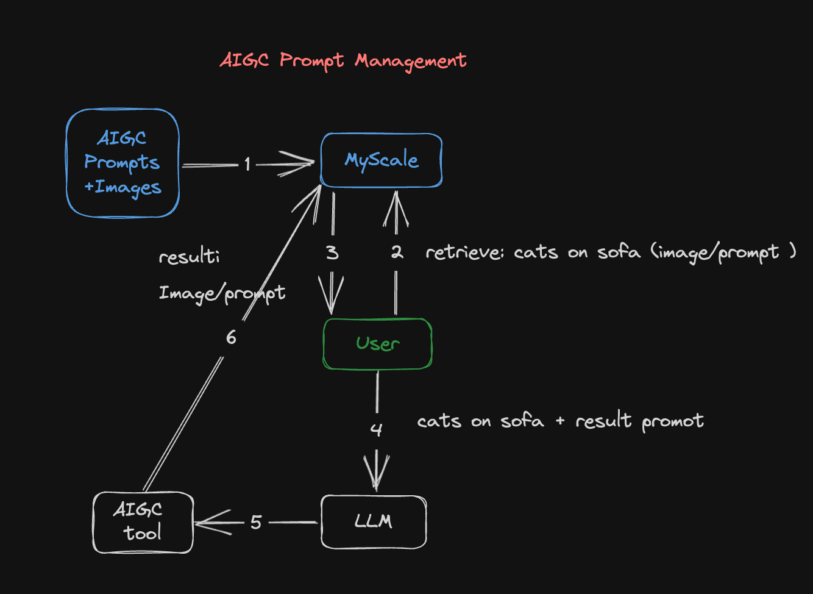
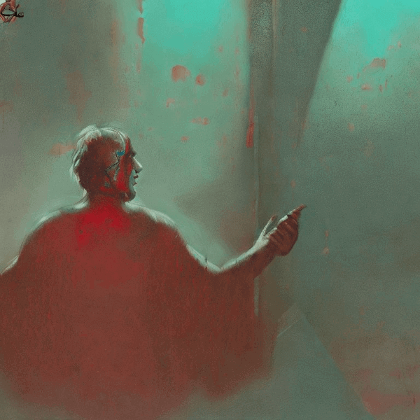
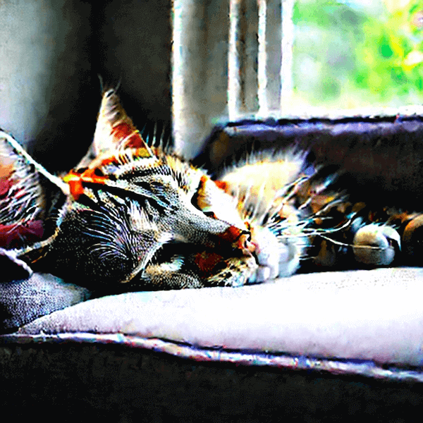
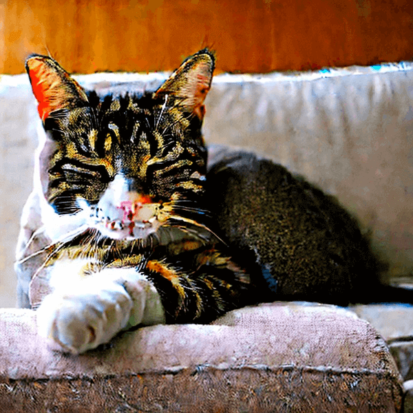

# AIGC Prompt Management

<a href="https://colab.research.google.com/drive/1C9ELnQEAQZjWmZhCOqlQvIWSvtOR_-Nv#scrollTo=kPFH2RsWrNj1" style="padding-left: 0.5rem;"></a>

AIGC (Artificial Intelligence Generated Content) has inspired and continues to inspire many individuals to create personal images that reflect their unique tastes and preferences.

In response to this growing fascination with AIGC, people are exploring innovative techniques, such as integrating Stable Diffusion and LLMs (Large Language Models).

But first, what is Stable Diffusion?

> [Stable Diffusion](https://en.wikipedia.org/wiki/Stable_Diffusion) is a "*deep learning, text-to-image model, primarily used to generate detailed images conditioned on text descriptions.*"

You can generate visually captivating images by harnessing the power of Stable Diffusion. In practice, as the Stable Diffusion model process renders the image, it is smooth and consistent, producing a detailed image.

As part of this creative process, adding powerful LLMs (Large Language Modes) into the mix allows users to input textual prompts or descriptions, enabling the AI system to generate corresponding images according to their aesthetic preferences. As a result, people are able to give life to their artistic visions, resulting in a sense of satisfaction as they see their artwork come to life and showcase the remarkable possibilities AIGC offers.

However, entering the initial text prompts or descriptions can be challenging. Fortunately, there is a solution: we can leverage the power of a vector database such as MyScale to overcome this hurdle.

How?

We can store and organize an extensive collection of prompts that have been used successfully to generate images in a MyScale vector database, providing a valuable resource for users who need inspiration or are struggling to find suitable prompts. A well-curated vector database makes it easy to find and retrieve prompts closely aligned with an image's intended style and concept.

 This, in turn, streamlines the creative process, making it more accessible and helping users with their prompt selections. Utilizing a vector database ultimately enables users to overcome the initial prompt challenge and begin generating images with confidence and clarity.

## Improving AIGC prompt management with MyScale

Where do we start?

Let's begin by using the following pipeline to create a vector database to store and organize our prompt collection:

1. **Discover the prompt for a given image:**
   To find the prompt text associated with a specific image, we can use MyScale to perform a reverse search. We can identify the prompt or prompts that likely generated the image by comparing its features to the stored vectors. We can learn from the creative process behind the image as a result.

2. **Find images resembling a specific style:**
   Utilizing MyScale allows us to search for images that closely resemble the style we aim to generate by comparing the vector representation of the desired style to the vector representations in the database. We can use the MyScale database to access curated images that can be valuable references and inspiration for image generation.

3. **Get specific prompts for a general idea:**
   With MyScale, we can search for images that closely resemble the style we intend to generate by comparing its vector representation to the vector representations in the database. The MyScale database provides access to curated images as valuable references and inspiration.

4. **Use search and LLMs to improve prompts:**
    Combining search algorithms and LLMs can improve the effectiveness of our prompts. Searching the vector database can find prompts that have historically produced relevant results. In addition to improving our existing prompts, these prompts serve as a starting point. We can also generate new prompt variations or refine existing ones using LLMs, optimizing the image generation process.

<div style="text-align: center; min-width: 600px;">

</div>

**Figure 1:** AIGC Prompt Management Pipeline

This diagram illustrates how AIGC's Prompt Management Pipeline generates an image:

1. The dataset containing the images and their related prompts is converted into embeddings and stored in a MyScale database. Embeddings involve converting images or prompts into vector representations allowing them to be retrieved and used later in this process.

2. The second step is to search the MyScale database using images or prompts. If you have an existing image, it can be transformed into a vector representation and compared against the database's image vectors. Similarly, if you have an existing prompt, it can be converted into a vector representation and compared to existing vectorized prompts.

3. The MyScale database returns results that match the input image or prompt. Once the query containing the image or prompt has been submitted to the database, it will return similar images or prompts stored there. 

4. You can refer to the image and prompt results returned from the database and use an LLM to improve the prompts. The LLM can analyze and learn from these results, generating unique and optimized prompts, and assisting you to refine your expectations and creative directions.

5. A Stable Diffusion model is then used to generate more accurate images based on the improved prompt. In practice, after you have improved the prompt, you feed it into the Stable Diffusion model to create images that are related to this prompt.

6. Last but not least, the generated images and improved prompts are stored in MyScale's database for future use. With the continual accumulation of images and prompts within the database, future searches and creative endeavors are made possible.

## Case study: generating an image

In this scenario, we use the [Stable Diffusion Model](https://huggingface.co/spaces/stabilityai/stable-diffusion) to generate an image based on the following prompt: "A cat sleeping on the sofa." 

The following image is generated:

<div style="text-align: center; min-width: 600px;">

</div>

A great start. But we can improve this image by diving into the following workflow:

### Install the prerequisites

The first step is to install the following prerequisites (as well as `streamlit`, `pandas`, `lmdb`, and `torch`) by running the CLI command at the bottom of this section:

* `transformers`: The CLIP model to create text and image embeddings
* `tqdm`: A beautiful progress bar
* `clickhouse-connect`: The MyScale database client

```shell
python3 -m pip install transformers tqdm clickhouse-connect streamlit pandas lmdb torch
```

### Prepare the data

Let's start with the [900k Diffusion Prompts Dataset](https://www.kaggle.com/datasets/tanreinama/900k-diffusion-prompts-dataset) from Kaggle.  This dataset comprises 900,000 pairs of Stable Diffusion prompts and their corresponding image URLs. Each pair includes a prompt from the Stable Diffusion model and an associated image URL.

For example:

| id  | prompt | url | width | height | source_site |
| --- | ---    | --- | ---   | ---    | ---         |
| 00000d0e-45cb-47b6-9f72-6a481e940d78 | man waking up, dark and still room, cinematic ... | Image_Url | 512 | 512 | [stablediffusionweb.com](http://stablediffusionweb.com/) |
  
As seen in this example, the dataset consists of the following six columns: 

* **id:** A unique identifier for each prompt and image pair
* **prompt:** The image pair's prompt
* **url:**  an URL pointing to the prompt's associated image
* **width:** The image's width
* **height:** The image's height
* **source_site:** The image's label

The image below is the actual image linked to this image pair. It is sourced by clicking on the Image_Url. 

<div style="text-align: center; min-width: 600px;">

</div>

### Create a MyScale database table

Unless you use MyScale's online console, you need a connection to our database backend to create a table in MyScale. 

> See our detailed guide on how to set up a [Python client](https://myscale.com/docs/en/python-client/) to connect to the MyScale database backend.

It will be much easier for you to work with MyScale if you are familiar with SQL (Structured Query Language).MyScale combines structured SQL queries with vector searches, including creating database tables. In other words, creating a vector database table is almost identical to creating a conventional database table. 

The following SQL statement describes how to create a vector table in SQL:

```sql
CREATE TABLE IF NOT EXISTS Prompt_text_900k(
        id String,
        prompt String,
        url String,
        width UInt64,
        height UInt64,
        source_site String,
        prompt_vector Array(Float32),
CONSTRAINT vec_len CHECK length(prompt_vector) = 512
) ENGINE = MergeTree ORDER BY id; 
```

### Extract text and image pairs, creating datasets

[CLIP](https://openai.com/blog/clip/) matches text and images to enable high-performance retrieval across modes. CLIP can learn to recognize objects and scenes in images and use the text to analyze the content. This allows it to match images and text with high accuracy and speed, enabling fast and accurate searching across multiple modes.

Here is an example:

```shell
import torchimport clipfrom PIL import Image
# Load the CLIP model
device = "cuda" if torch.cuda.is_available() else "cpu"
model, preprocess = clip.load("ViT-B/32", device=device)
# Load and preprocess the image
# Encode the text
text = "Your text here"
text_input = clip.tokenize([text]).to(device)
with torch.no_grad():
    text_features = model.encode_text(text_input)
# Print the image and text features
print("Image features shape:", image_features.shape)
print("Text features shape:", text_features.shape)
```

### Upload the data to MyScale

Next, the embeddings are uploaded to MyScale and a vector index is created, as shown in the following Python extract: 

```python
# upload data from datasets
client.insert("Prompt_text_900k", 
              data_text.to_records(index=False).tolist(), 
              column_names=data_image.columns.tolist())

# create vector index with cosine
client.command("""
ALTER TABLE Prompt_text_900k
ADD VECTOR INDEX prompt_vector_index feature
TYPE MSTG
('metric_type=Cosine')
""")
```

### Search the MyScale database

When a user inputs a prompt, we convert it into a vector and use it to query the database, returning the top n-number of prompts and their corresponding images. We use the following steps to search the MyScale database:
  
* The first step is to convert the prompt (question) into a vector, as the following code snippet indicates: 
  
  ```python
  question = 'A cat is sleeping on the sofa'
  emb_query = retriever.encode(question).tolist()
  ```

* The second step is to run a query that will search the dataset and return the top no-number of prompts (texts) and their corresponding images, as seen in the following code snippet: 

  ```python
  top_k = 2
  results = client.query(f"""
  SELECT prompt, url, distance(prompt_vector, {emb_query}) as dist
  FROM Prompt_text_900k
  ORDER BY dist LIMIT {top_k}
  """)

  summaries = {'prompt': [], 'url': []}
  for res in results.named_results():
    summaries['prompt'].append(res["prompt"])
    summaries['url'].append(res["url"])
  ```

The query results are described in the following code snippet:

```python
{'prompt':['`two cute calico cats sleeping inside a cozy home in the evening, two multi - colored calico cats`','`two cats sleeping by the window Chinese new year digital art painting by makoto shinkai`'],
'url': ['`https://image.lexica.art/full_jpg/c6fc8242-86b6-4a2c-adee-3053bb345147`','https://image.lexica.art/full_jpg/06c4451c-ce40-4926-9ec7-0381f3dcc028']}
```

With the URLs pointing to the images:

<div style="text-align: center; min-width: 600px;">
    
    
</div>

### Generate new images

Using GPT4's API, we can create new prompts with GPT4 based on the data returned from this query, as demonstrated in the following code snippet:

```python
system_message = f"""
    Please provide a more native-sounding rewrite of the user-input 
    image generation prompt based on the following description
    {summaries}
"""
```

The following images will be generated using these new prompts:

<div style="text-align: center; min-width: 600px;">
    
    
</div>

> Image retrieval can also be done using a similar pipeline.

## Conclusion

Personalized images are at the heart of the AIGC trend. It is possible to create visually captivating content using Stable Diffusion and LLMs.With MyScale, you can find suitable prompts as described throughout this article with its comprehensive vector database. Users can overcome challenges, refine creativity, and interact with AIGC using MyScale with Stable Diffusion and LLMs, resulting in unique AI-generated content.
