# SQL Execution

MyScale provides a **SQL Workspace** for you to edit, run, save SQL worksheets, as well as to view query results. 

- [Open SQL Workspace](#open-sql-workspace)
- [Using the SQL Workspace](#using-the-sql-workspace)
- [In-Workspace Cluster Operations](#in-workspace-cluster-operations)
- [Editor](#editor)
  - [Statement Autocomplete](#statement-autocomplete)
  - [Formatting Feature](#formatting-feature)
  - [Word Wrap Mode](#word-wrap-mode)
  - [Keyboard Shortcuts](#keyboard-shortcuts)
- [Run Worksheets](#run-worksheets)
- [View Results](#view-results)
  - [Execution State](#execution-state)
  - [Query Results](#query-results)
  - [Execution Statistics](#execution-statistics)
  - [Exporting Results to Local Disk](#exporting-results-to-local-disk)
- [Save Worksheets](#save-worksheets)

## Open SQL Workspace
<br>
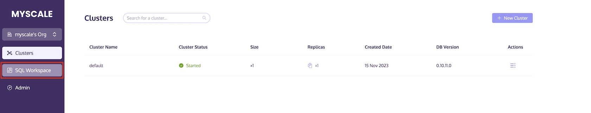

The **SQL Workspace** may be reached by the side navigation bar. 

## Using the SQL Workspace

The SQL Workspace is partitioned into three main areas:

- On the left-hand side lies an **"Object Viewer"**, where you may peruse through your database's tables and views. Prior to inspecting any objects, it is necessary to launch the corresponding cluster. You may opt to scrutinize the particular attributes of an object by selecting it in the viewer, such as a table and its columns and data types.
- The upper-right portion houses an **“Editor”**, allows you to write SQL statements, save SQL worksheets and run SQL statements.
- The lower-right section consists of the **“Results”**, allows you to view the running status and results of the current SQL statements.


## In-Workspace Cluster Operations

The **"Object Viewer"** provides options for managing the cluster used to execute SQL statements. From the top of the viewer, you can switch between clusters, start them, or stop them as needed. To select a specific cluster for running SQL statements, simply click on the cluster selection list and choose the desired option.

<div style="text-align: center">
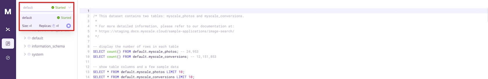
</div>

## Editor

The **Editor** can help you organize your SQL statements. While a worksheet supports multiple query statements, each statement must end with a semicolon ( ; ).

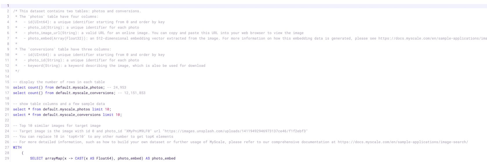

### Statement Autocomplete

As you type SQL statements in the editor, MyScale suggests keywords and object names. Pressing the `Tab/Enter` key swiftly adds the first suggested word in the list to your statement, or you may select a different item from the list using the arrow keys, then press `Tab/Enter`.

### Formatting Feature

You may click on the "Format" button or use the shortcut `opt/alt+shift+f` to format the entire editor.

We recommend using the formatting feature when entering lengthy content, such as high-dimensional vector data, to present a cleaner interface in the editor. This will enable you to easily verify and inspect SQL statements.

**Before formatting:**

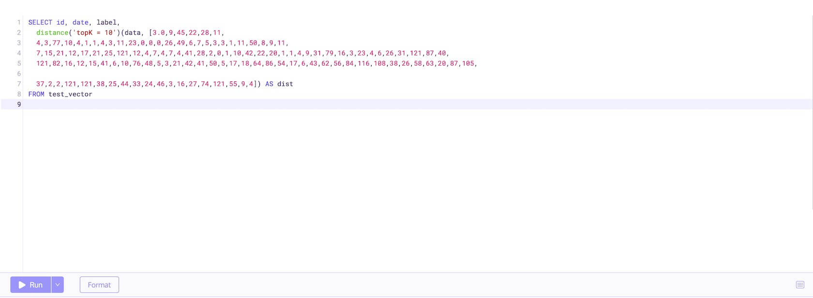

**After formatting:**

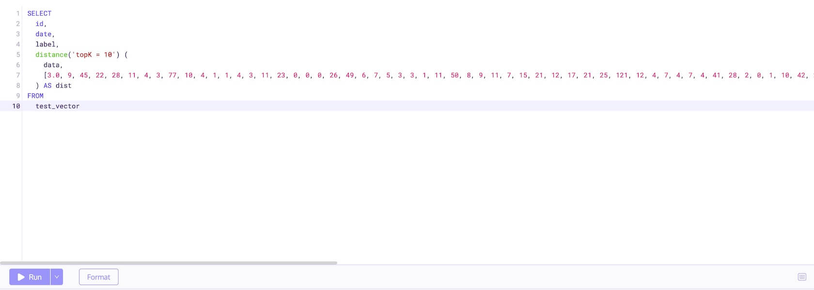

### Word Wrap Mode

If you prefer to conveniently view the complete overview of high-dimensional vector data, you may try using the shortcut `opt/alt+z` to toggle word wrap mode on or off.

**Word wrap mode off:**


**Word wrap mode on:**

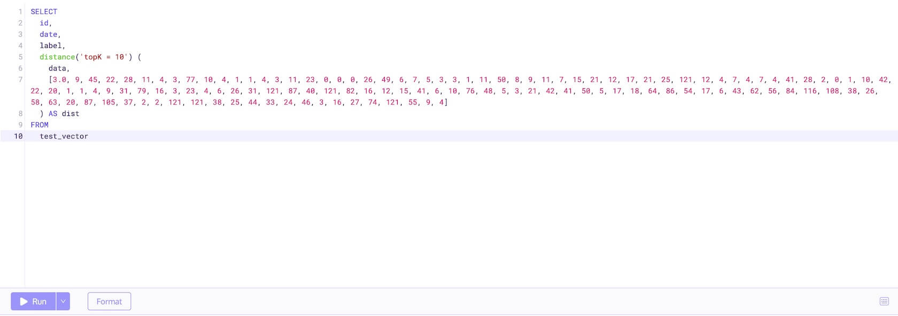

### Keyboard Shortcuts

You may click the keyboard icon to view available keyboard shortcuts, or you may refer to the full list on the [keyboard shortcuts](keyboard-shortcuts.md) page.

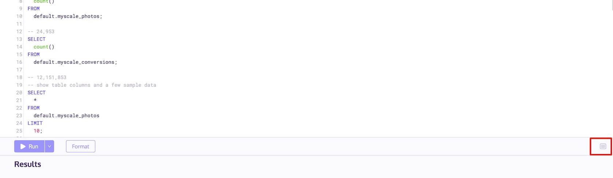

## Run Worksheets

To execute a query, type your SQL command in the SQL Editor and then click the "Run" button or use the shortcut `cmd/ctrl+enter`.

Query Execution Options: By default, when you use the "Run" button, the selected command will be executed. If you have not selected any commands, MyScale will automatically separate SQL statements and run the statement where the cursor is located.

Meanwhile, if you want to run all commands in sequence in the SQL Editor, you can click the dropdown button to the right of the Run button and select "Run all" (or use the shortcut `cmd/ctrl+shift+enter`).

<div style="text-align: center">
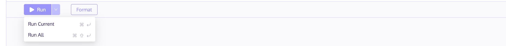
</div>

## View Results

As your SQL statement is running, its state is displayed in the **Results** section.

### Execution State

There are five execution states for SQL query, `Executing`, `Succeed`, `Background`, `Canceled` and `Error`.

Each query has a maximum execution time limit, which is 30 seconds by default. If a query exceeds this time limit, one of the following two scenarios may occur:

1. If the query is a `SELECT` statement, it will be canceled and an error will be thrown.
2. For all other statements, they will be converted to a `Background` state. If you'd like to monitor the execution state of this query, please use the following statement.
```SQL
SELECT * 
FROM clusterAllReplicas('{cluster}', system.query_log)
WHERE query_id='YOUR_QUERY_ID'
ORDER BY event_time_microseconds DESC
LIMIT 1;
```

`YOUR_QUERY_ID` could be found in [Execution Statistics](#execution-statistics).


### Query Results

Once query is completed, the Results section will display the results of the latest SQL run and the statistics of the query execution.

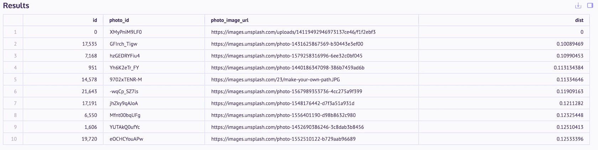

There will be at most 10,000 rows in the result table. If your query returns more than 10,000 rows, follow [Exporting Results to Local Disk](#exporting-results-to-local-disk) section to download results to obtain all the results.

You can click on a cell to view the specific contents of that cell.

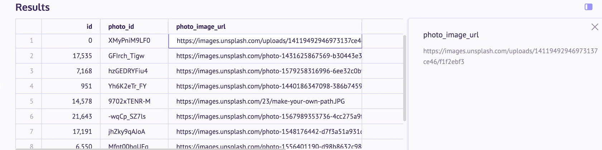

### Execution Statistics

You can view query execution statistics by opening the **Statistics** tab.

<div style="text-align: center">
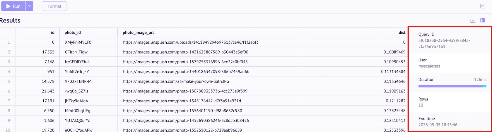
</div>
<br>

| Term                   | Definition                                                                                   | 
| :--------------------- | :------------------------------------------------------------------------------------------- | 
| Query ID               | The present operation's id.                                                                  |
| User                   | The user that created this operation.                                                        |
| Duration               | The total duration of this operation is divided into two phases, Transmission and Execution. |
| Rows                   | The number of rows returned by the query result.                                             |
| End time               | The time that the operation ended.                                                           |

<div style="text-align: center">
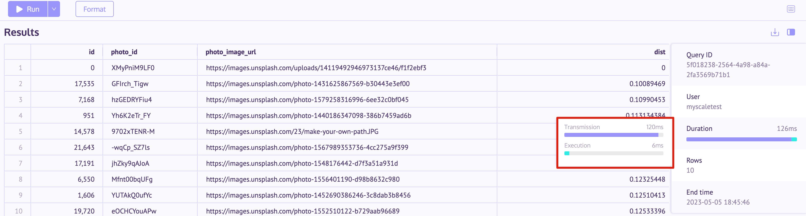
</div>
<br>

| Term           | Definition                                                                                 | 
| :------------- | :----------------------------------------------------------------------------------------- | 
| Transmission   | Transmission refers to the time spent on non-execution tasks such as network transmission. |
| Execution      | Execution refers to the time taken by the database to execute the query.                   |

### Exporting Results to Local Disk

After running a query, you have the option to export the results to your local hard drive.

- Click on the download icon as shown in the figure below:

<div style="text-align: center">
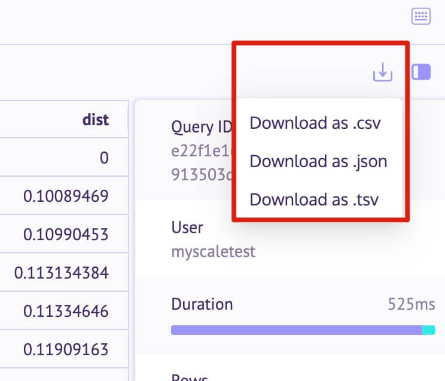
</div>

- You may select Download as .csv, .json, or .tsv format. MyScale will download the file to your browser's default download location according to your selection.

## Save Worksheets

Whenever a SQL statement is executed, MyScale automatically saves the contents on the current Worksheet. You can log back in from any device at any time to see the contents of this worksheet.
