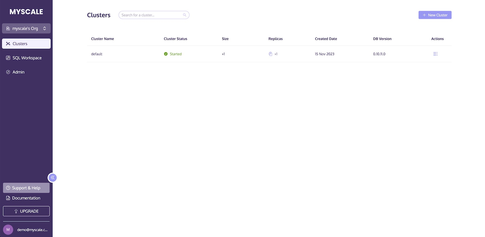
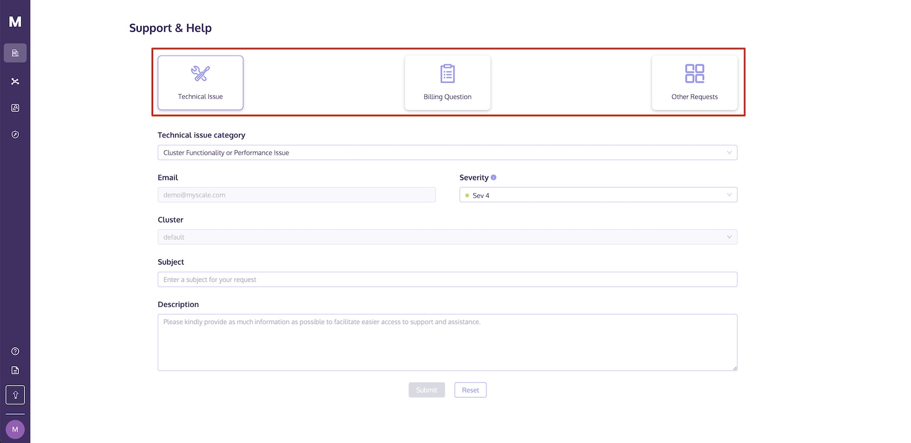
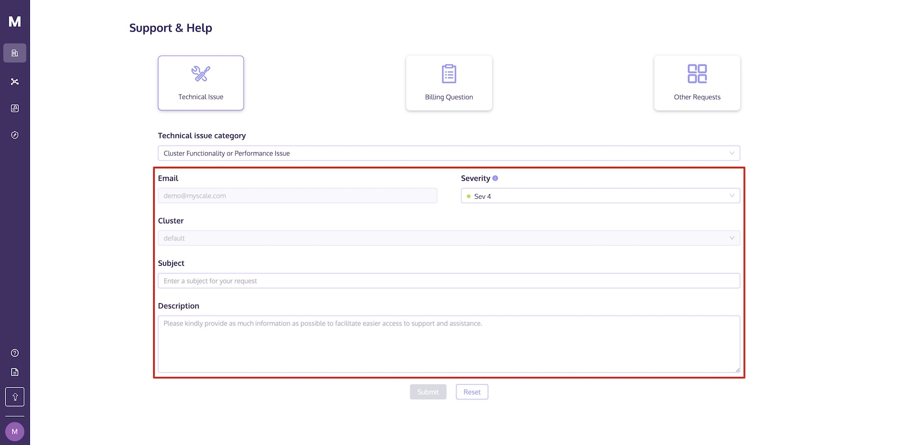

# Support & Help

MyScale provides comprehensive support services to address questions or issues arising from errors. This includes troubleshooting, diagnosis, and recommendations for potential workarounds during the Subscription Term. For detailed information, please refer to the  <a :href="$themeConfig.homeUrl + '/support/'" target="_blank" rel="noopener">Support Policy and Service Level Agreement</a>.

To access Support & Help through the MyScale console, follow these steps below:

1. Sign in to MyScale.
2. Click on Support & Help.

3. Select the type of assistance you require.

4. Fill in the essential information.

5. Submit your request.

## Note

- If you require support for the Cluster you have currently created, kindly ensure to provide the relevant Cluster information to enable the MyScale team to offer more effective assistance.
